---
## Front matter
title: "Лабораторная работа №3"
subtitle: "Анализ трафика в Wireshark"
author: "Демидова Екатерина Алексеевна"

## Generic otions
lang: ru-RU
toc-title: "Содержание"

## Bibliography
# bibliography: bib/cite.bib
# csl: pandoc/csl/gost-r-7-0-5-2008-numeric.csl

## Pdf output format
toc: true # Table of contents
toc-depth: 2
lof: true # List of figures
lot: false # List of tables
fontsize: 12pt
linestretch: 1.5
papersize: a4
documentclass: scrreprt
## I18n polyglossia
polyglossia-lang:
  name: russian
  options:
	- spelling=modern
	- babelshorthands=true
polyglossia-otherlangs:
  name: english
## I18n babel
babel-lang: russian
babel-otherlangs: english
## Fonts
mainfont: PT Serif
romanfont: PT Serif
sansfont: PT Sans
monofont: PT Mono
mainfontoptions: Ligatures=TeX
romanfontoptions: Ligatures=TeX
sansfontoptions: Ligatures=TeX,Scale=MatchLowercase
monofontoptions: Scale=MatchLowercase,Scale=0.9
## Biblatex
biblatex: true
biblio-style: "gost-numeric"
biblatexoptions:
  - parentracker=true
  - backend=biber
  - hyperref=auto
  - language=auto
  - autolang=other*
  - citestyle=gost-numeric
## Pandoc-crossref LaTeX customization
figureTitle: "Рис."
tableTitle: "Таблица"
listingTitle: "Листинг"
lofTitle: "Список иллюстраций"
lotTitle: "Список таблиц"
lolTitle: "Листинги"
## Misc options
indent: true
header-includes:
  - \usepackage{indentfirst}
  - \usepackage{float} # keep figures where there are in the text
  - \floatplacement{figure}{H} # keep figures where there are in the text
---

# Цель работы

Изучение посредством Wireshark кадров Ethernet, анализ PDU протоколов транспортного и прикладного уровней стека TCP/IP.

# Задание

1. MAC-адресация
   1. Изучение возможностей команды ipconfig для ОС типа Windows (ifconfig для систем типа Linux).
   2. Определение MAC-адреса устройства и его типа.
2. Анализ кадров канального уровня в Wireshark
   1. Установить на домашнем устройстве Wireshark.
   2. С помощью Wireshark захватить и проанализировать пакеты ARP и ICMP в части кадров канального уровня
3. Анализ протоколов транспортного уровня в Wireshark. С помощью Wireshark захватить и проанализировать пакеты HTTP, DNS в части заголовков и информации протоколов TCP, UDP, QUIC.
4. Анализ handshake протокола TCP в Wireshark.С помощью Wireshark проанализировать handshake протокола TCP.

# Выполнение лабораторной работы

## MAC-адресация

С помощью команды `ifconfig` выведем информацию о текущем сетевом соединении (рис. @fig:001).

{#fig:001 width=70%}

Так же добавив название сетевого интерфейса можно вывести информацию только о нём(рис. @fig:002).

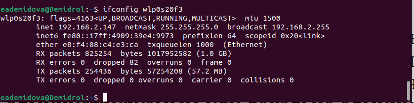{#fig:002 width=70%}

Теперь выключим сетевой интерфейс добавив команду `down`(с помощью команды`up` его можно включить). При использовании команды `ifconfig` его не видно, так как это сетевое соединение больше не активно, но можно использовать опцию `-a`, которая показывает все сетевые интерфейсы, даже не активные(рис. @fig:003).

{#fig:003 width=70%}

Также можно использовать опцию `-s`, с помощью которой выводится краткий список интерфейсов(рис. @fig:004). При таком выводе можно увидеть информацию только о следующих параметрах:

- MTU	-- Максимальное число байтов в пакете
- RX-OK	-- Пакеты, принятые без ошибок
- RX-ERR -- Пакеты, принятые с ошибками
- RX-DRR -- Пропавшие пакеты
- RX-OVR -- Ошибки из-за превышения скорости
- TX-OK	-- Пакеты, переданные без ошибок
- TX-ERR -- Пакеты, переданные с ошибками
- TZ-DRR -- Пакеты, потерянные при передаче
- TX-OVR -- Пакеты, которые не смогли передать
- Flags -- Характеристики интерфейса
  - A -- принимает пакеты в случае многоадресной передачи
  - B -- принимает широковещательные пакеты
  - D -- отладка включена
  - L -- закольцовывающий интерфейс
  - M -- изменяется динамически (переадресация)
  - N -- без обработки завершителей пакетов
  - O -- протокол преобразования адресов выключен
  - P -- интерфейс "точка-точка"
  - R -- интерфейс работает
  - U -- интерфейс активизирован

{#fig:004 width=70%}

MAC-адрес сетевого интерфейса можно увидеть так же с помощью команды `ifconfig`, посмотрев на поле ether, но MAC-адрес виртуального интерфейса не показывается. Можно использовать команду `ip -brief link`, чтобы увидеть только MAC-адреса (рис. @fig:005). Видно, что у виртуального интерфейса все биты в нуле, а у второго сетевого интерфейса MAC-адрес - e8:f4:08:c4:e3:ca.

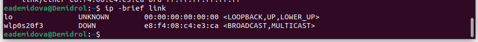{#fig:005 width=70%}

Первые три байта e8:f4:08 в этом адресе соответствуют индентификатору производителя, в Интернете можно найти, какой компании соответствует этот индентификатор(рис. @fig:006). Последние три байта c4:e3:ca индентифицируют сетевой интерфейс. 

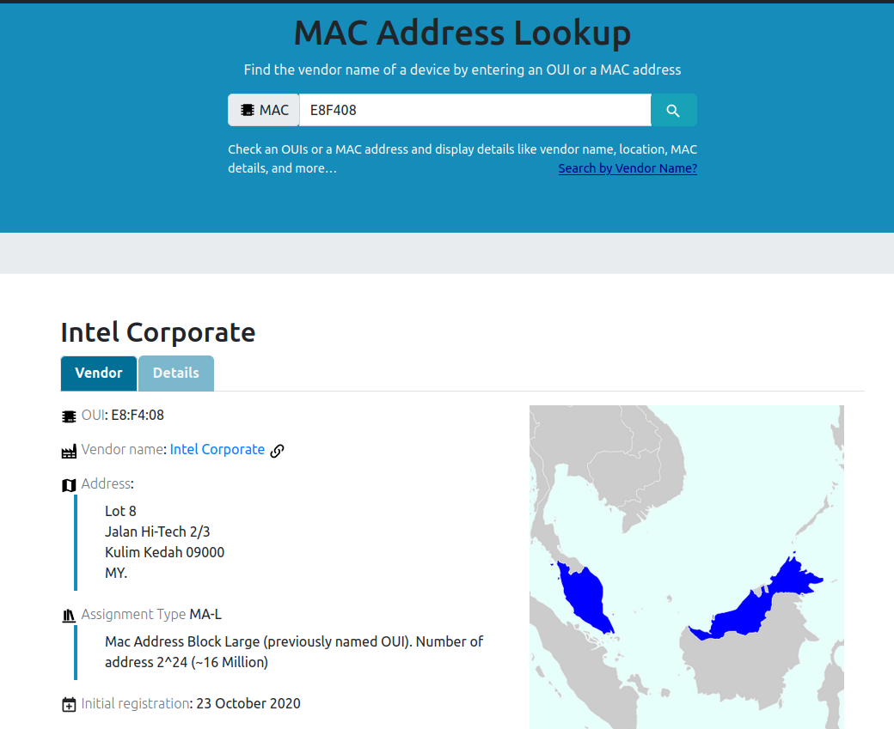{#fig:006 width=70%}

Возьмем первый байт e8 и переведём его в двоичную систему. Получим 11101000. Так как последний бит ноль, то адрес является индивидуальным. А так как предпоследний бит ноль, то адрес глобально администрируемый.

## Анализ кадров канального уровня в Wireshark

Запустим wireshark и начнем захват трафика (рис. @fig:007).

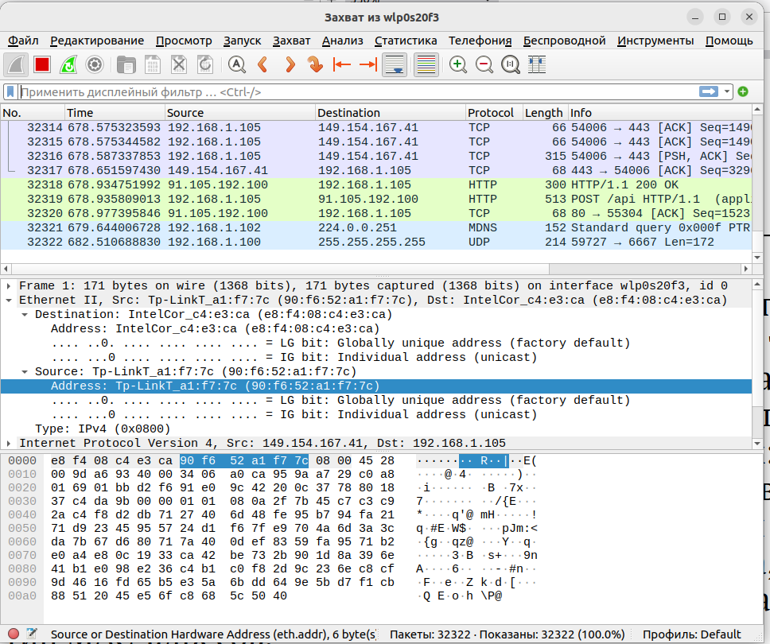{#fig:007 width=70%}

С помощью команды `ifconfig`  определим IP-адрес устройства -- 192.168.1.105. Шлюз по умолчанию на моём устройстве не отображается с помощью этой команды, поэтому я использовала также команду `ip route`, шлюз по умолчанию -- 192.168.1.1(рис. @fig:008).

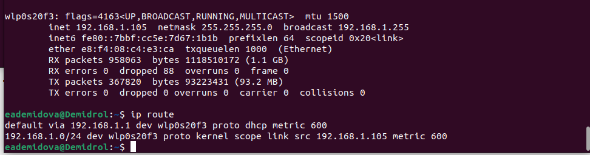{#fig:008 width=70%}

С помощью команды `ping 192.168.1.1` пропингуем шлюз по умолчанию (рис. @fig:009). 

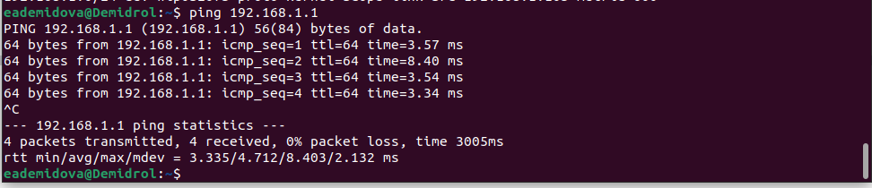{#fig:009 width=70%}

Затем остановим захват трафика wireshark и пропишем фильтр `arp or icmp`. В списке пакетов отобразились только пакеты ARP и ICMP, в частности пакеты, которые были сгенерированы с помощью команды ping  (рис. @fig:010). Изучим эхо-запрос и эхо-ответ ICMP в программе Wireshark. На панели списка пакетов (верхний раздел) выберем первый указанный кадр ICMP — эхо-запрос (@fig:010). Изучим информацию на панели сведений о пакете в средней части экрана. Длинf кадра равняется 98 байт, заголовок Ethernet первые 14 байт кадра, кадр относится к типу Ethernet II. MAC-адрес  шлюза -- это первые 6 байт заголовка Ethernet, а MAC-адрес  источника -- следующие 6 байт заголовка Ethernet, оба MAC-адреса являются индивидуальными и глобально администрируемыми.

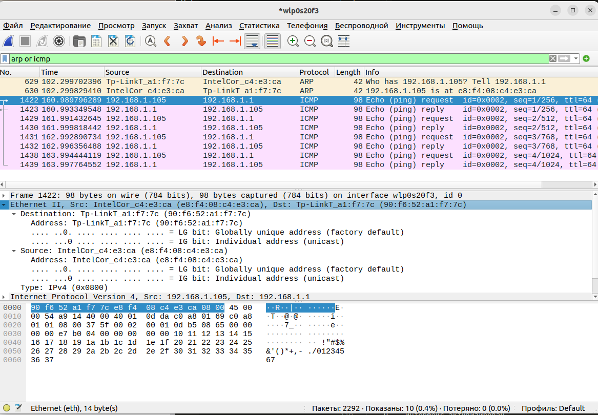{#fig:010 width=70%}

На панели списка пакетов (верхний раздел) выберем второй указанный кадр ICMP — эхо-ответ (@fig:011). Изучим информацию на панели сведений о пакете в средней части экрана. Длинf кадра равняется 98 байт, заголовок Ethernet первые 14 байт кадра, кадр относится к типу Ethernet II. MAC-адрес пункта назначения -- это первые 6 байт заголовка Ethernet, а MAC-адрес шлюза(источника) - следующие 6 байт заголовка Ethernet, оба MAC-адреса являются индивидуальными и глобально администрируемыми.

{#fig:011 width=70%}

На панели списка пакетов (верхний раздел) выберем второй указанный кадр ARP (@fig:012). Изучим информацию на панели сведений о пакете в средней части экрана. Длинf кадра равняется 42 байтf, заголовок Ethernet первые 14 байт кадра, кадр относится к типу Ethernet II. MAC-адрес пункта назначения -- это первые 6 байт заголовка Ethernet, а MAC-адрес источника - следующие 6 байт заголовка Ethernet, оба MAC-адреса являются индивидуальными и глобально администрируемыми. Также в заголовке Ethernet последние два байта обозначают вложенным пакет типа ARP.

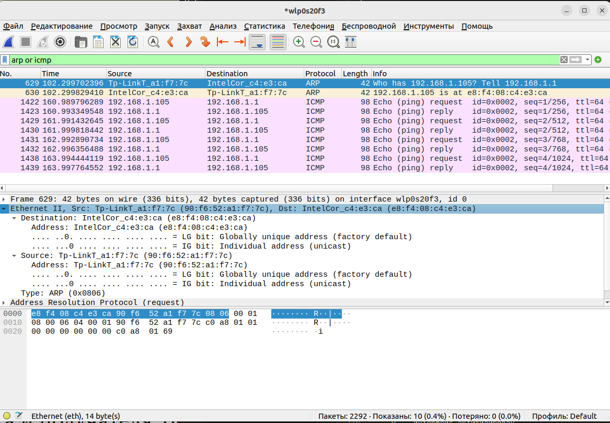{#fig:012 width=70%}

Теперь начнём новый процесс захвата трафика и пропингуем сайт wikipedia.org (@fig:013). 

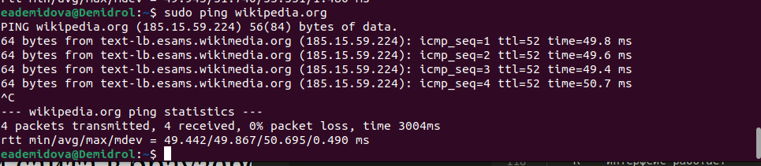{#fig:013 width=70%}

Изучим эхо-запрос и эхо-ответ ICMP в программе Wireshark (@fig:014, @fig:0015). Изучим информацию на панели сведений о пакете в средней части экрана. В обоих случаях длина кадра равняется 98 байт, заголовок Ethernet первые 14 байт кадра и кадр относится к типу Ethernet II. В случае эхо-запроса точка назначения -- сайт, а источник -- сетевой интерфейс моего устройства, в случае же эхо-ответа -- наоборот. MAC-адрес  точки назначения -- это первые 6 байт заголовка Ethernet, а MAC-адрес  источника -- следующие 6 байт заголовка Ethernet, оба MAC-адреса являются индивидуальными и глобально администрируемыми.
 

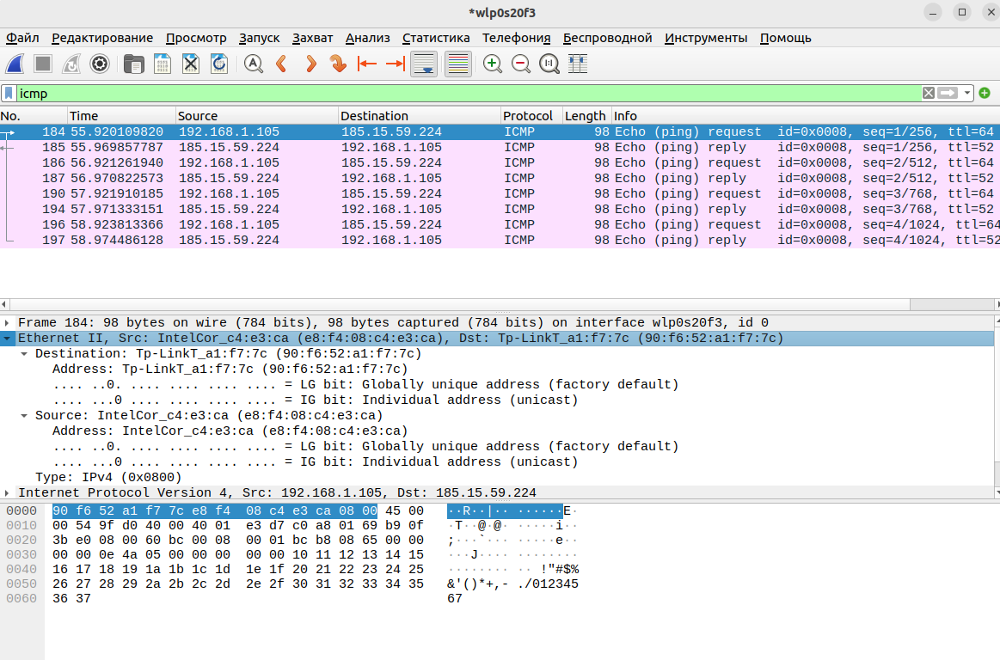{#fig:014 width=70%}

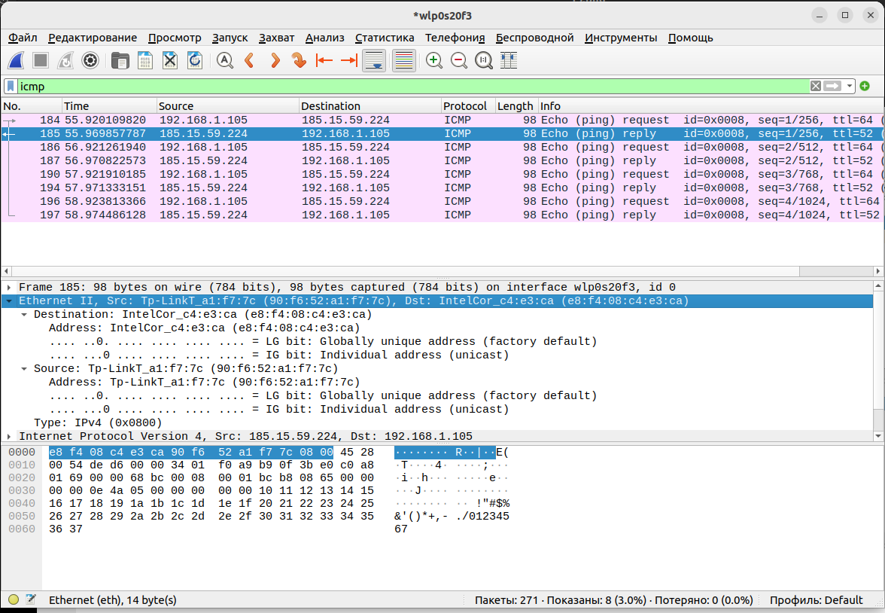{#fig:015 width=70%}

Изучим запрос и ответ ARP в программе Wireshark(@fig:016,@fig:0017). Изучим информацию на панели сведений о пакете в средней части экрана. В обоих случаях длина кадра равняется 42 байтf, заголовок Ethernet первые 14 байт кадра и кадр относится к типу Ethernet II. В случае запроса точка назначения -- сетевой интерфейс оборудования, а источник -- шлюз по умолчанию, в случае же эхо-ответа -- наоборот, эхо-ответ сообщает шлюзу по умолчанию MAC-адрес сетевого интерфейса. MAC-адрес  точки назначения -- это первые 6 байт заголовка Ethernet, а MAC-адрес  источника -- следующие 6 байт заголовка Ethernet, оба MAC-адреса являются индивидуальными и глобально администрируемыми.

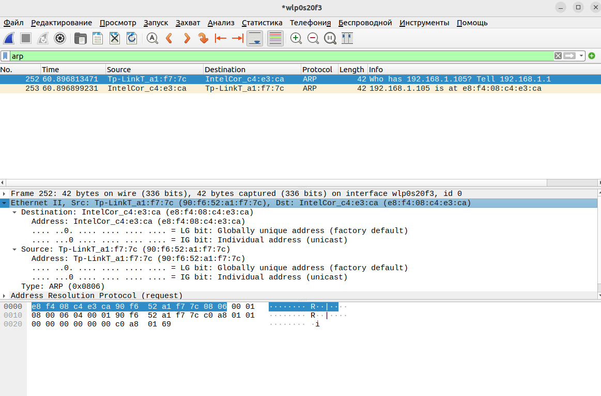{#fig:016 width=70%}

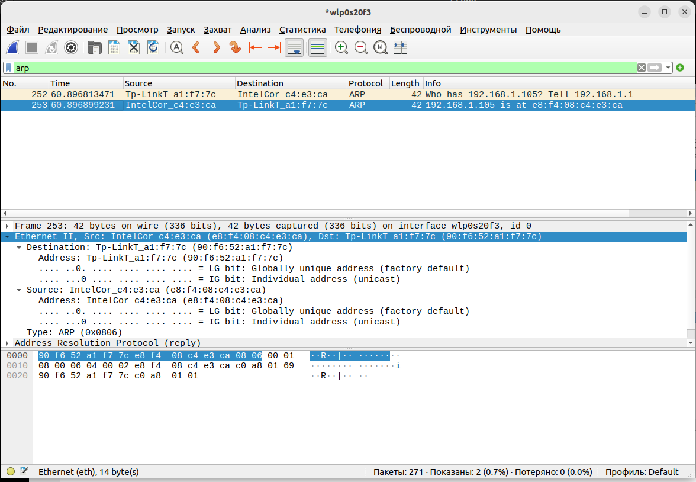{#fig:017 width=70%}

## Анализ протоколов транспортного уровня в Wireshark

В браузере перейдем на сайт, работающий по протоколу
HTTP, а именно на сайт CERN http://info.cern.ch/. Поперемещаемся по ссылкам и разделам сайта.
В Wireshark в строке фильтра укажим http и проанализируем информацию по протоколу TCP в случае запросов и ответов. 

Порт источника задан случайно, выбором из непривелигированных и незанятых портов, и равен 555882, порт назначения равен 80 - это стандартный порт HTTP(@fig:018). 

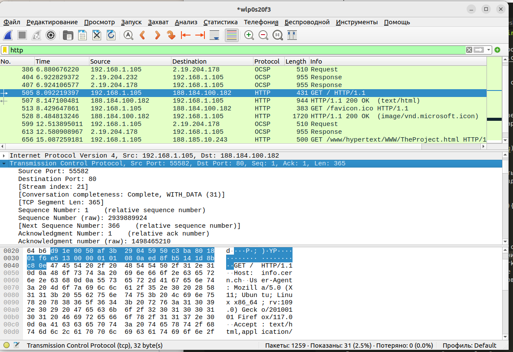{#fig:018 width=70%}

В случае ответа порты заданы наоборот, то есть источник - 80 порт, назначение - 55582 (@fig:019). В разделе HTP можно увидеть ссылку на html-страницу(@fig:020). А в разделе Line-based text data находится содержимое страницы, которую перехватил wireshark(@fig:021).

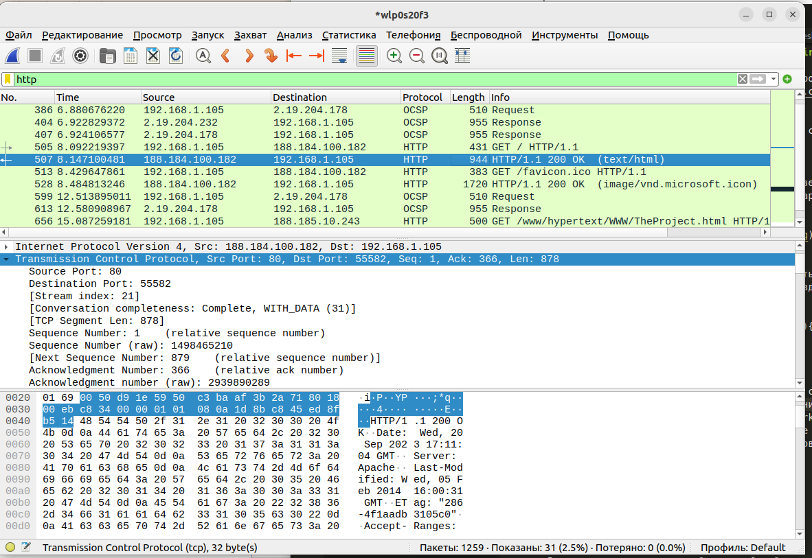{#fig:019 width=70%}

{#fig:020 width=70%}

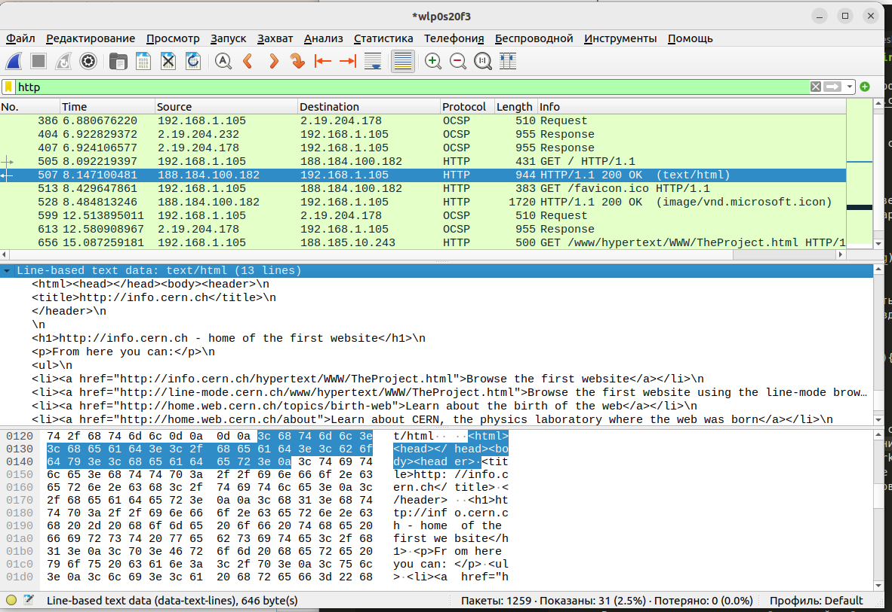{#fig:021 width=70%}

Wireshark в строке фильтра укажем dns и проанализируем информацию по протоколу UDP в случае запросов и ответов. Протокол UDP добавляет номера портов, то есть вводит адрес транспортного уровня. Порт источника задан случайно, выбором из непривелигированных и незанятых портов, и равен 555882, порт назначения равен 53 - это стандартный порт DNS(@fig:022). 

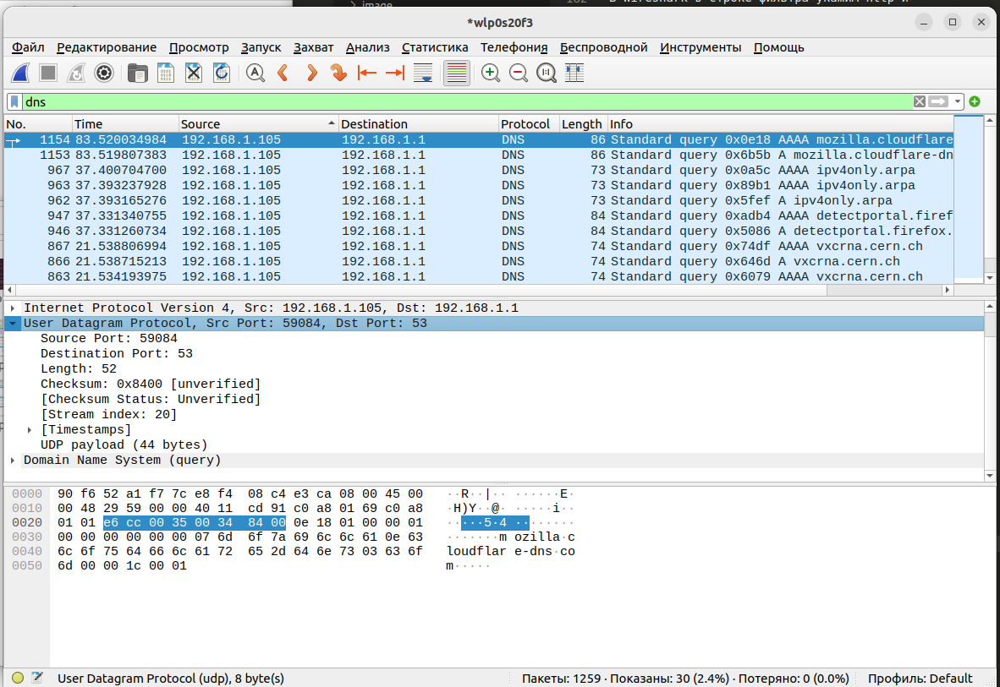{#fig:022 width=70%}

В случае ответа порты заданы наоборот, то есть источник - 53 порт, назначение - 59084 (@fig:023).

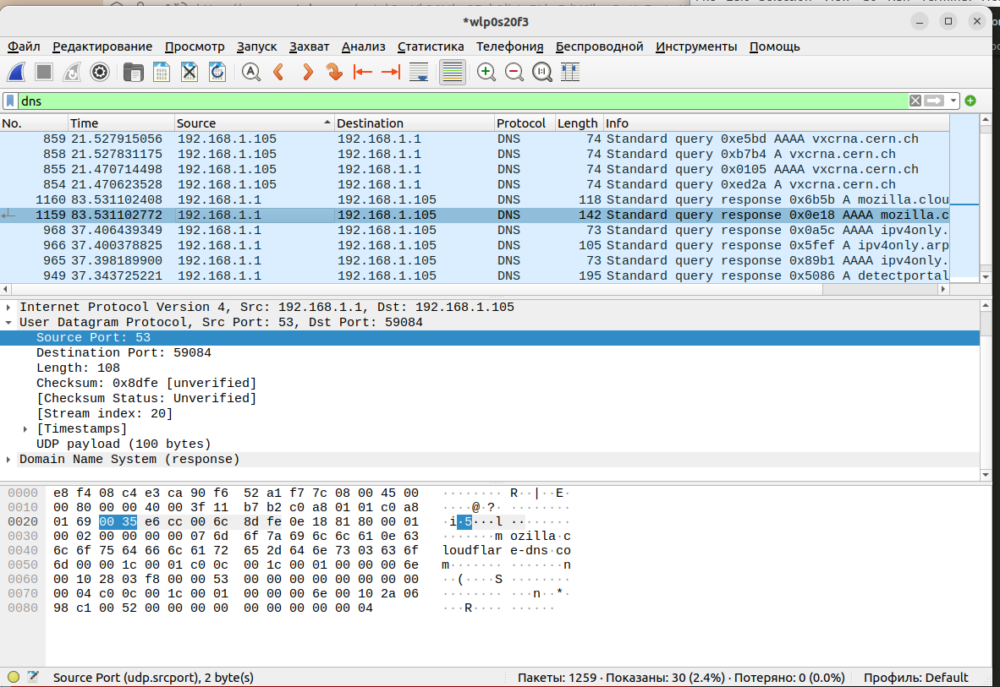{#fig:023 width=70%}   

В Wireshark в строке фильтра укажем quic и проанализируем информацию по протоколу quic в случае запросов и ответов. Как и в случае dns можем посмотреть информацию транспортного уровня по протоколу UDP. Порт источника задан случайно, выбором из непривелигированных и незанятых портов, и равен 47597, порт назначения равен 443 - это стандартный порт HTTPS, то есть quic сразу криптуется(@fig:024). 

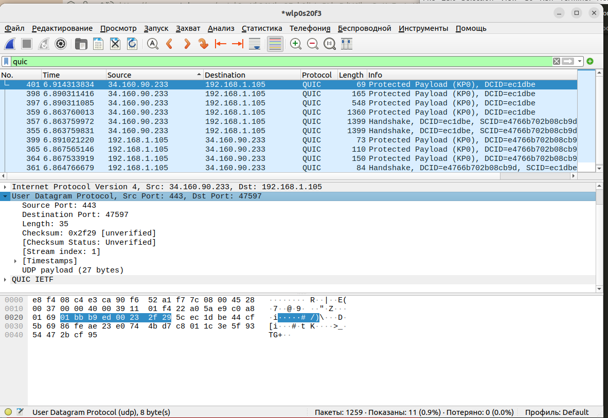{#fig:024 width=70%} 

В случае ответа порты заданы наоборот, то есть источник - 443 порт, назначение - 47597 (@fig:024).

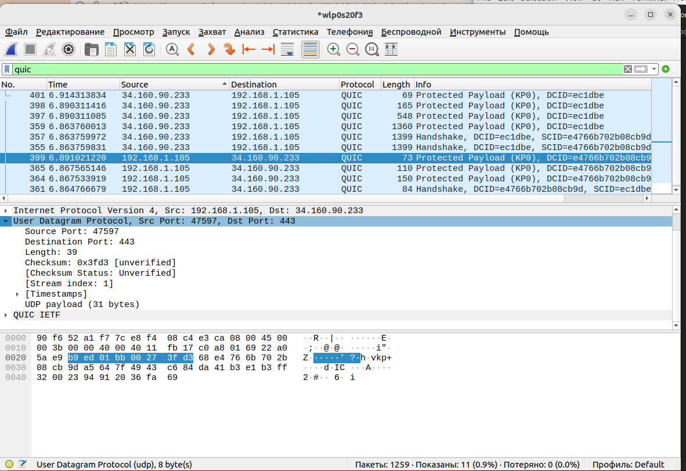{#fig:025 width=70%}  

Для создания альтернативы TCP поверх UDP строятся протоколы прикладного уровня QUIC IETF, которые управляют трафиком, управляют качеством обслуживания, устанавливают и разрывают соединение (@fig:026, @fig:027).

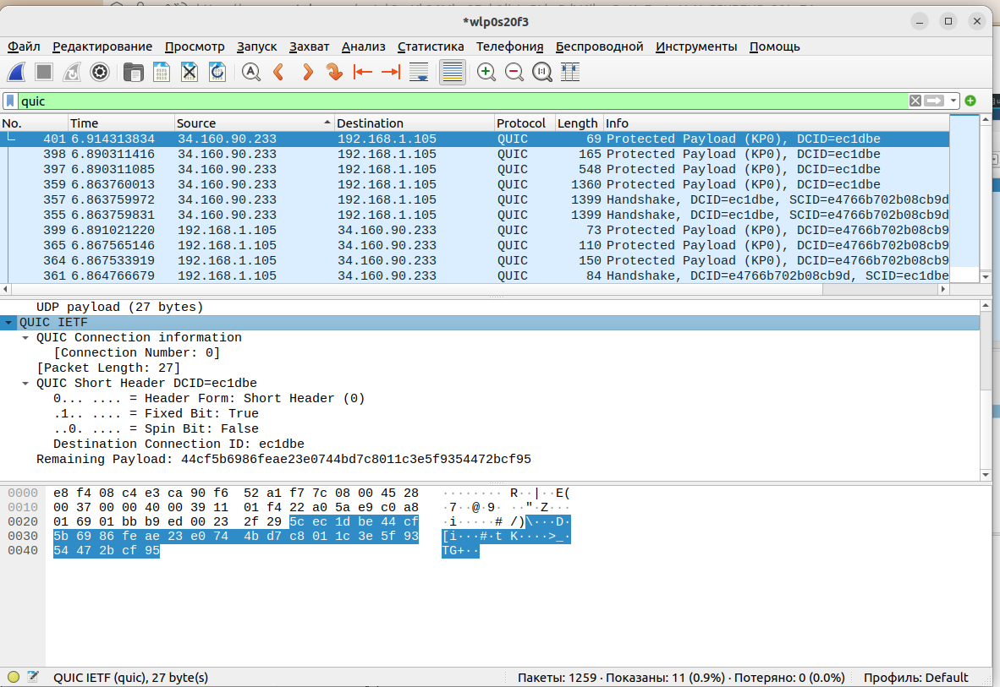{#fig:026 width=70%}  

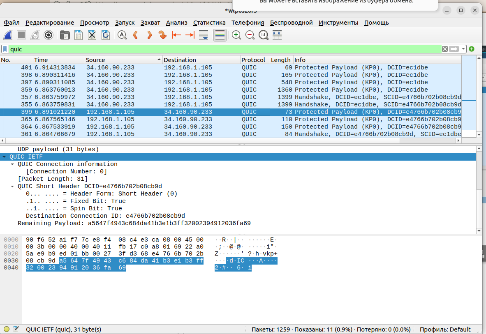{#fig:027 width=70%}  

## Анализ handshake протокола TCP в Wireshark

Используем соединение по HTTP с сайтом http://info.cern.ch для захвата в Wireshark пакетов TCP.

Проанализируем handshake протокола TCP. Установление связи клиент-сервер в TCP осуществляется в три этапа (трёхступенчатый handshake). Опишем эти этапы на примере.

1. Режим активного доступа. Клиент посылает сообщение SYN, ISSa, т.е. в передаваемом сообщении установлен бит SYN (Synchronize Sequence Number), а в поле Порядковый номер (Sequence Number) — начальное 32-битное значение ISSa (Initial Sequence Number). 

Во вкладке с флагами видно, что установлен бит SYN(Syn: set). Порядковый номер равен 3980370530(@fig:028).

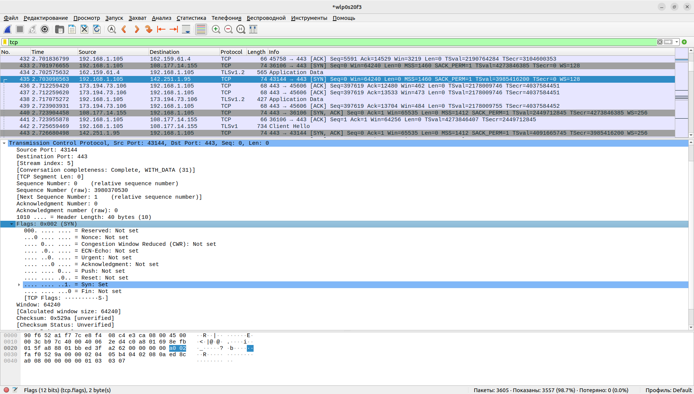{#fig:028 width=70%}  

2. Режим пассивного доступа. Сервер откликается, посылая сообщение SYN, ACK, ISSb, ACK(ISSa+1), т.е. установлены биты SYN и ACK; в поле Порядковый номер (Sequence Number) хостом B устанавливается начальное значение счётчика — ISSb; поле Номер подтверждения (Acknowledgment Number) содержит значение ISSa, полученное в первом пакете от хоста A и увеличенное на единицу.

Во вкладке с флагами видно, что установлены биты SYN и ACK(Syn: set, Acknowldgment: set). Порядковый номер содержит значение ISSb и равен 452625189. Поле номер подтверждения равен значению ISSa, которое получил в предыдущем пакете, плюс 1, то есть 3980370531(@fig:029).

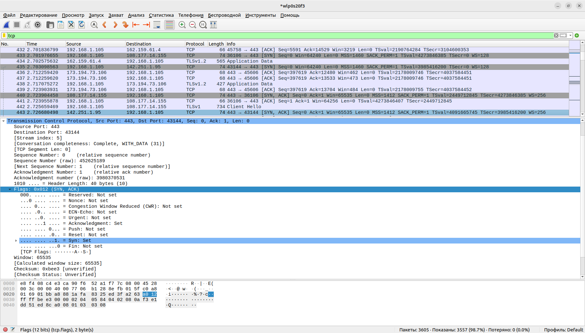{#fig:029 width=70%}  

3. Завершение рукопожатия. Клиент отправляет подтверждение получения SYN-сегмента от сервера с идентификатором, равным ISN (сервера)+1: ACK, ISSa+1, ACK(ISSb+1). В этом пакете установлен бит ACK, поле Порядковый номер (Sequence Number) содержит ISSa+1, поле Номер подтверждения (Acknowledgment Number) содержит значение ISSb+1. Посылкой этого пакета заканчивается трёхступен-чатый handshake, и TCP-соединение считается установленным.

Во вкладке с флагами видно, что установлен бит ACK(Acknowldgment: set). Порядковый номер равен ISSa+1 и равен 3980370531. Поле номер подтверждения равен значению ISSb, которое получил в предыдущем пакете, плюс 1, то есть 452625190.(@fig:030).

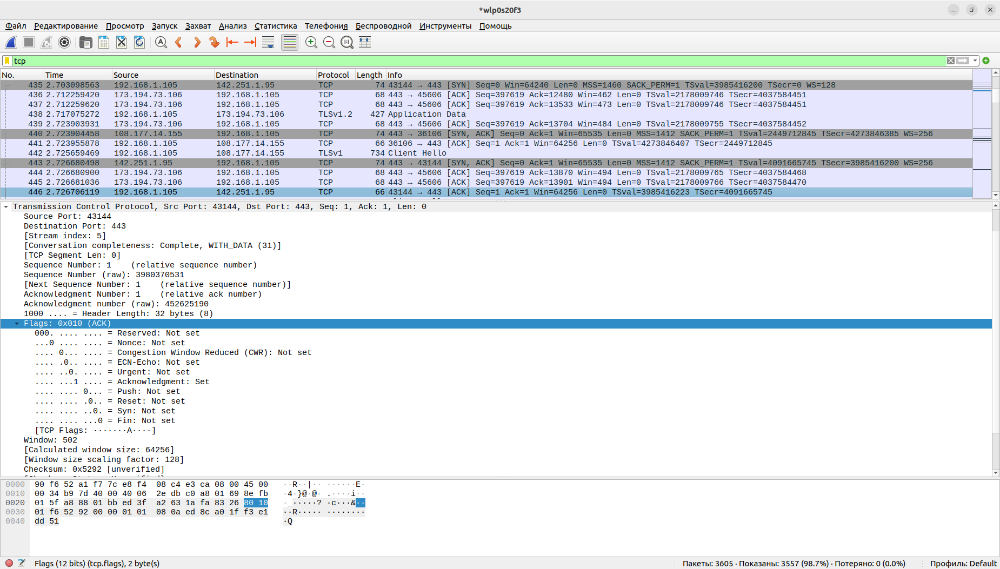{#fig:030 width=70%}  

Теперь клиент может посылать пакеты с данными на сервер по только что созданному виртуальному TCP-каналу: ACK, ISSa+1, ACK(ISSb+1).

В Wireshark в меню «Статистика» выберем «График Потока». В отчёте приведите пояснения по изменениям значений соответствующих сообщений при
установлении соединения по TCP.

На графике видно, что сначала клиент послал сообщение на сервер(стрелка вправо), а значение seq = 0. Затем сервер откликнулся(стрелка влево), значение seq = 0, а значение ack = 1. И в третьем пакете клиент оправил подтверждение получение SYN-сегмента(стрелка влево), оба значения syn и ack стали равны 1 (@fig:031).

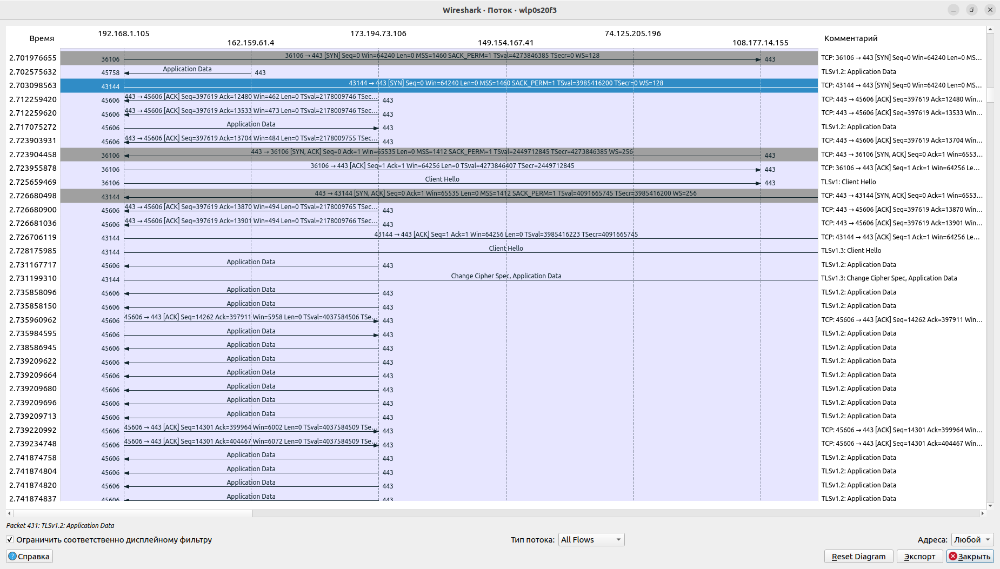{#fig:031 width=70%}  

# Выводы

В результате выполнения лабораторной работы посредством Wireshark были изучены кадры Ethernet, а также проанализированы PDU протоколы транспортного и прикладного уровней стека TCP/IP.

