---
## Front matter
lang: ru-RU
title: Лабораторная работа №4
subtitle: Подготовка экспериментального стенда GNS3
author:
  - Демидова Е. А.
institute:
  - Российский университет дружбы народов, Москва, Россия
date: 28 сентября 2023

## i18n babel
babel-lang: russian
babel-otherlangs: english

## Formatting pdf
toc: false
toc-title: Содержание
slide_level: 2
aspectratio: 169
section-titles: true
theme: metropolis
header-includes:
 - \metroset{progressbar=frametitle,sectionpage=progressbar,numbering=fraction}
 - '\makeatletter'
 - '\beamer@ignorenonframefalse'
 - '\makeatother'
---

# Вводная часть

## Цель работы

Установка и настройка GNS3 и сопутствующего программного обеспечения.

## Задание

1. Установить GNS3-all-in-one, GNS3 VM, проверить корректность запуска.
2. Импортировать в GNS3 образ маршрутизатора FRR.
3. Импортировать в GNS3 образ маршрутизатора VyOS.

# Установка  GNS3-all-in-one, GNS3 VM

## Установка  GNS3-all-in-one

```
sudo add-apt-repository ppa:gns3/ppa
sudo apt update                                
sudo apt install gns3-gui gns3-server
```

## Установка  GNS3-all-in-one

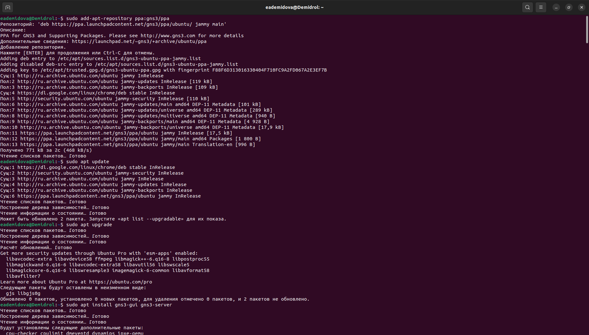{#fig:001 width=70%}

## Установка  GNS3 VM

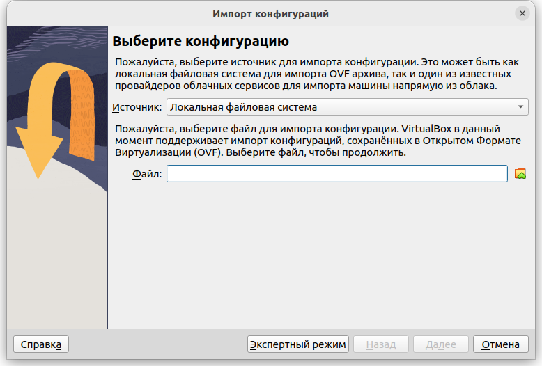{#fig:002 width=70%}

## Установка  GNS3 VM

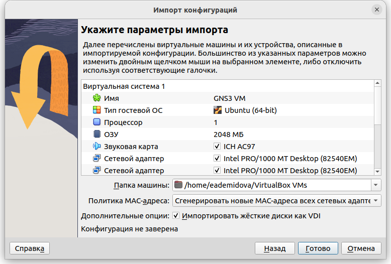{#fig:003 width=70%}

## Установка  GNS3 VM

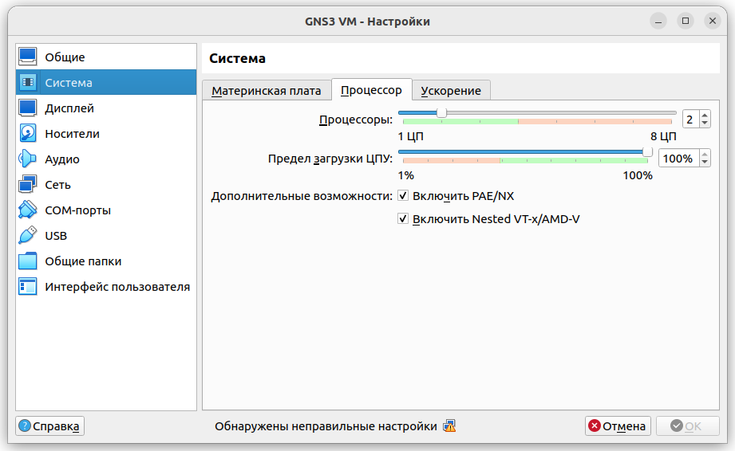{#fig:004 width=70%}

## Установка  GNS3 VM

```
vboxmanage modifyvm "GNS3 VM" --nested-hw-virt on
```

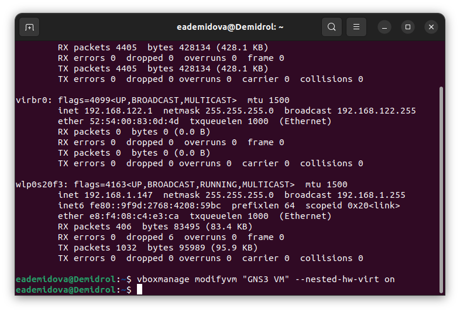{#fig:005 width=60%}

## Запуск экземпляра GNS3 в VirtualBox

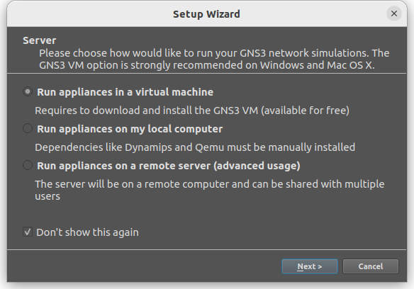{#fig:006 width=70%}

## Запуск экземпляра GNS3 в VirtualBox

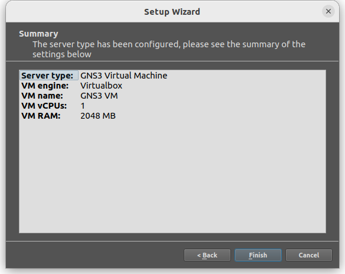{#fig:007 width=70%}

## Запуск экземпляра GNS3 в VirtualBox

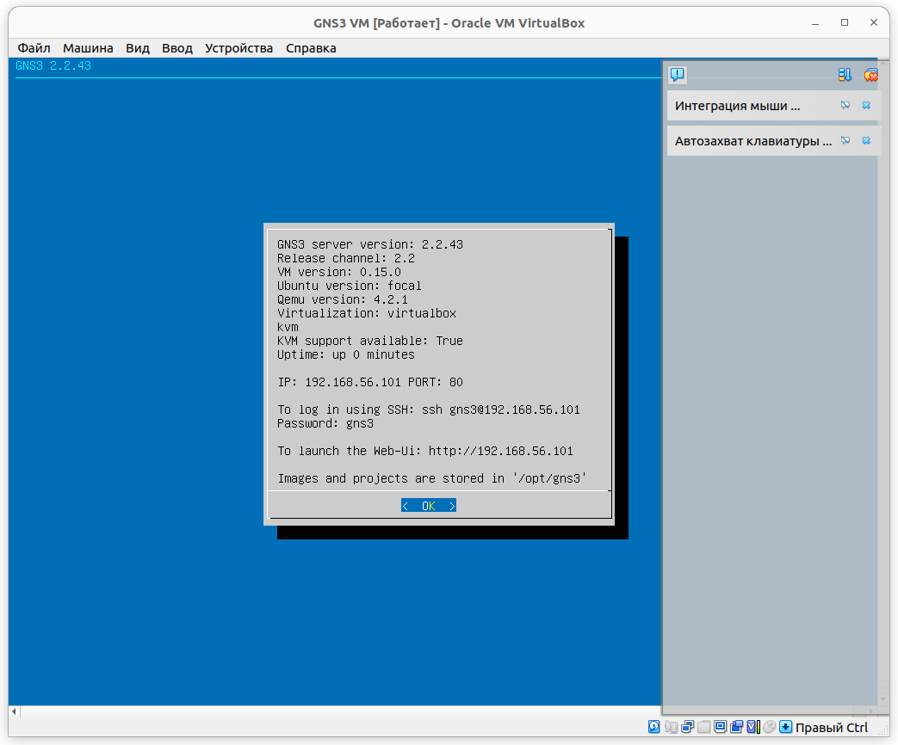{#fig:008 width=70%}

# Добавление образа маршрутизатора FRR

## Добавление образа маршрутизатора FRR

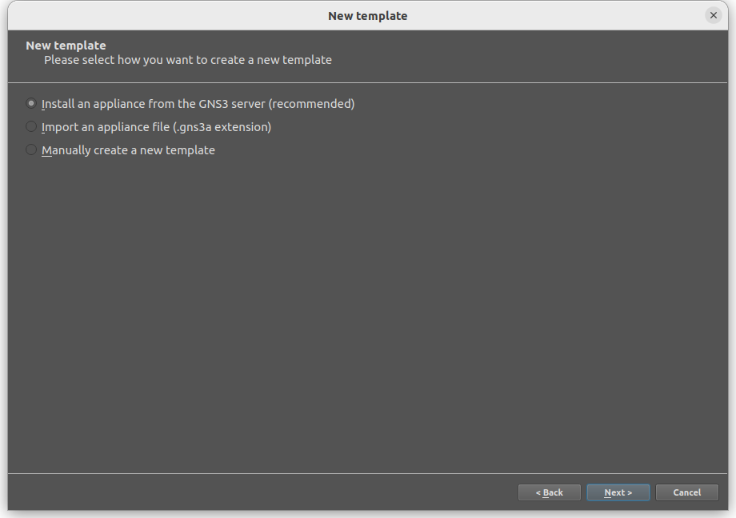{#fig:009 width=70%} 

## Добавление образа маршрутизатора FRR

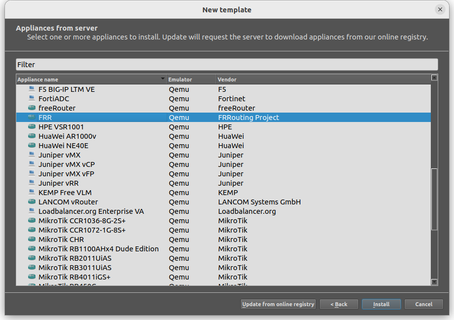{#fig:010 width=70%}

## Добавление образа маршрутизатора FRR

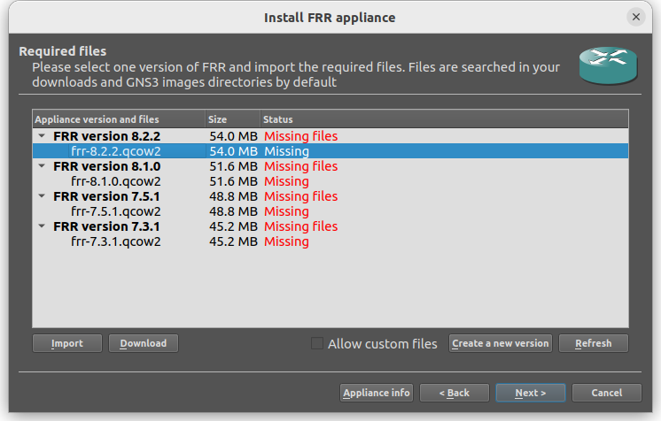{#fig:011 width=70%}

## Добавление образа маршрутизатора FRR

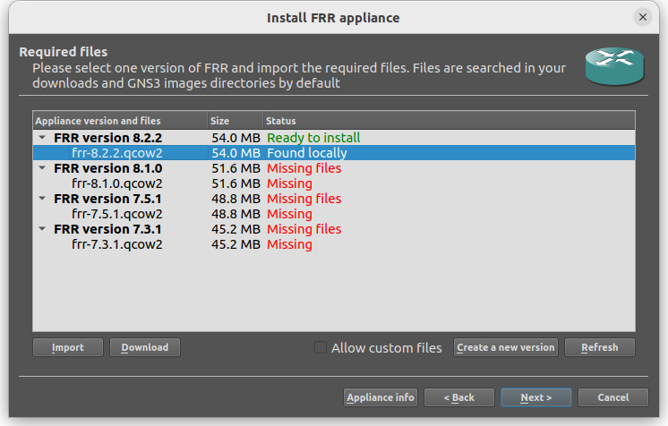{#fig:012 width=70%}

## Добавление образа маршрутизатора FRR

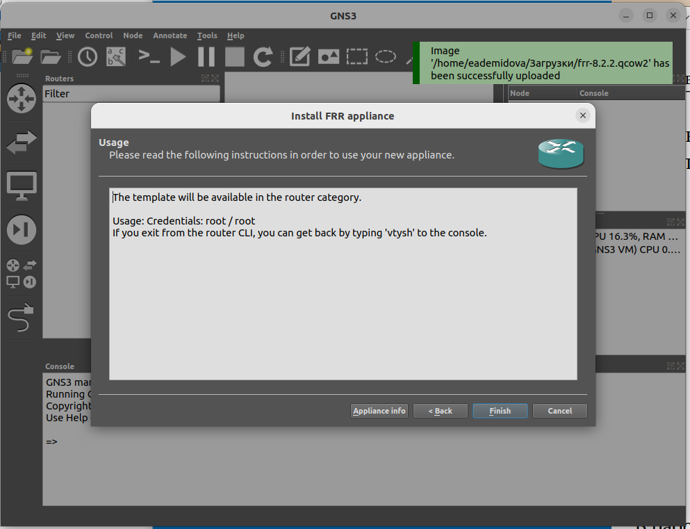{#fig:013 width=60%}

## Добавление образа маршрутизатора FRR

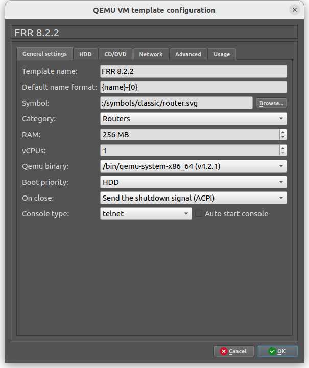{#fig:014 width=40%}

## Добавление образа маршрутизатора FRR

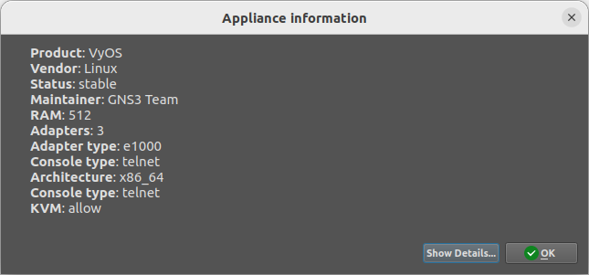{#fig:015 width=70%}

# Добавление образа маршрутизатора VyOS

## Добавление образа маршрутизатора VyOS

Скачали  файл vyos-edu.gns3a из репозитория: https://github.com/yamadharma/vyos-build/releases. Затем импортировали vyos-edu.gns3a в GNS3 через пункт меню File>Import appliance.

## Добавление образа маршрутизатора VyOS

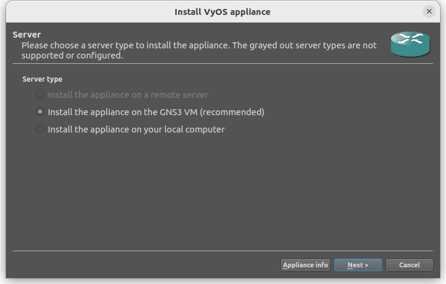{#fig:016 width=70%}

## Добавление образа маршрутизатора VyOS

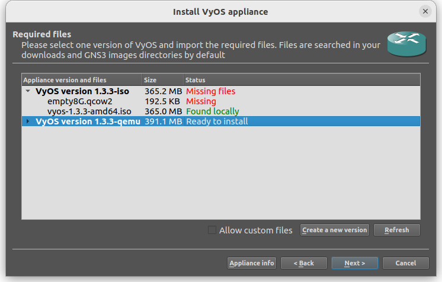{#fig:017 width=70%}

## Добавление образа маршрутизатора VyOS

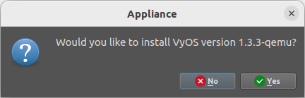{#fig:018 width=70%}

## Добавление образа маршрутизатора VyOS

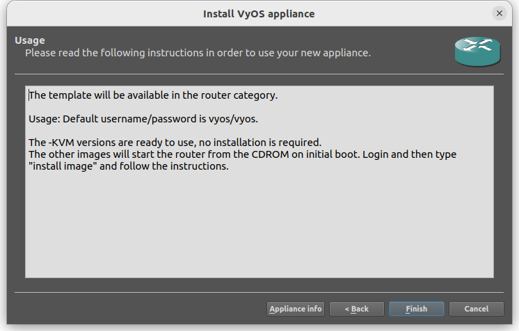{#fig:019 width=70%}

## Добавление образа маршрутизатора VyOS

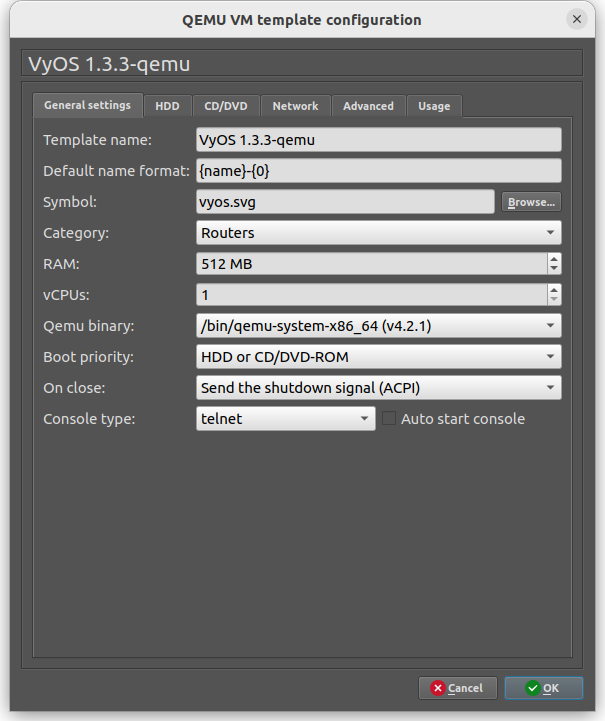{#fig:020 width=40%}

# Выводы

В результате выполнения лабораторной работы были установлены  GNS3-all-in-one, GNS3 VM и проверена корректность их работы. Также импортированы образы маршрутизаторов FRR и VyOS.