---
## Front matter
title: "Лабораторная работа №4"
subtitle: "Подготовка экспериментального стенда GNS3"
author: "Демидова Екатерина Алексеевна"

## Generic otions
lang: ru-RU
toc-title: "Содержание"

## Bibliography
# bibliography: bib/cite.bib
# csl: pandoc/csl/gost-r-7-0-5-2008-numeric.csl

## Pdf output format
toc: true # Table of contents
toc-depth: 2
lof: true # List of figures
lot: false # List of tables
fontsize: 12pt
linestretch: 1.5
papersize: a4
documentclass: scrreprt
## I18n polyglossia
polyglossia-lang:
  name: russian
  options:
	- spelling=modern
	- babelshorthands=true
polyglossia-otherlangs:
  name: english
## I18n babel
babel-lang: russian
babel-otherlangs: english
## Fonts
mainfont: PT Serif
romanfont: PT Serif
sansfont: PT Sans
monofont: PT Mono
mainfontoptions: Ligatures=TeX
romanfontoptions: Ligatures=TeX
sansfontoptions: Ligatures=TeX,Scale=MatchLowercase
monofontoptions: Scale=MatchLowercase,Scale=0.9
## Biblatex
biblatex: true
biblio-style: "gost-numeric"
biblatexoptions:
  - parentracker=true
  - backend=biber
  - hyperref=auto
  - language=auto
  - autolang=other*
  - citestyle=gost-numeric
## Pandoc-crossref LaTeX customization
figureTitle: "Рис."
tableTitle: "Таблица"
listingTitle: "Листинг"
lofTitle: "Список иллюстраций"
lotTitle: "Список таблиц"
lolTitle: "Листинги"
## Misc options
indent: true
header-includes:
  - \usepackage{indentfirst}
  - \usepackage{float} # keep figures where there are in the text
  - \floatplacement{figure}{H} # keep figures where there are in the text
---

# Цель работы

Установка и настройка GNS3 и сопутствующего программного обеспечения.

# Задание

1. Установить GNS3-all-in-one, GNS3 VM, проверить корректность запуска.
2. Импортировать в GNS3 образ маршрутизатора FRR.
3. Импортировать в GNS3 образ маршрутизатора VyOS.

# Выполнение лабораторной работы

## Установка  GNS3-all-in-one, GNS3 VM

Установим GNS3-all-in-one. Для этого используем инструкцию с официального сайта GNS3. Для этого нам понадобятся следующие команды(рис. @fig:001):
```
sudo add-apt-repository ppa:gns3/ppa
sudo apt update                                
sudo apt install gns3-gui gns3-server
```

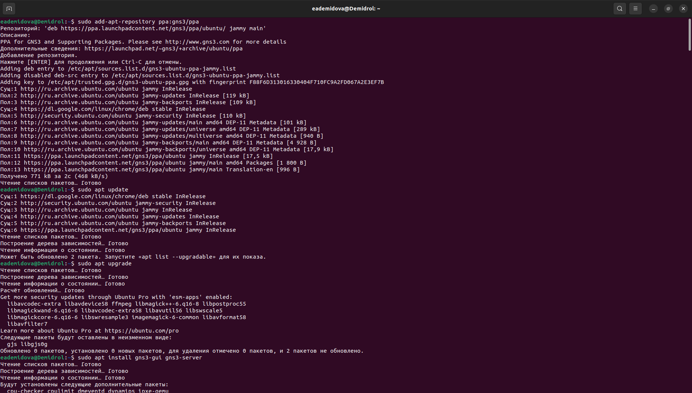{#fig:001 width=70%}

Затем установим GNS3VM, воспользовавшись установочным файлом с официального сайта. Перейдем в каталог, в который скачан архив с образом виртуальной машины
GNS3.VM.VirtualBox.2.2.43.zip. Распакуем архив с образом. Затем запустим VirtualBox. Выберем меню Файл Импорт конфигураций(рис. @fig:002). Укажем месторасположение распакованного образа GNS3 VM.ova.

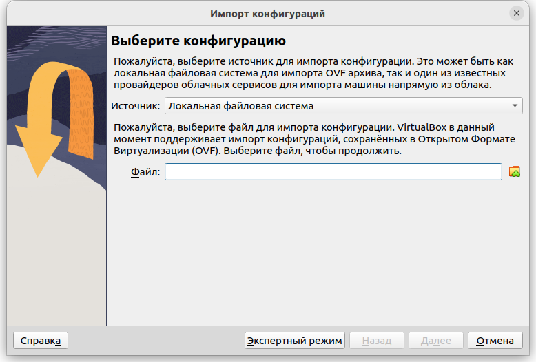{#fig:002 width=70%}

В следующем окне в параметрах импорта выберем в политику MAC-адреса «Сгенерировать
новые MAC-адреса всех сетевых адаптеров» и нажмеме импорт(рис. @fig:003).

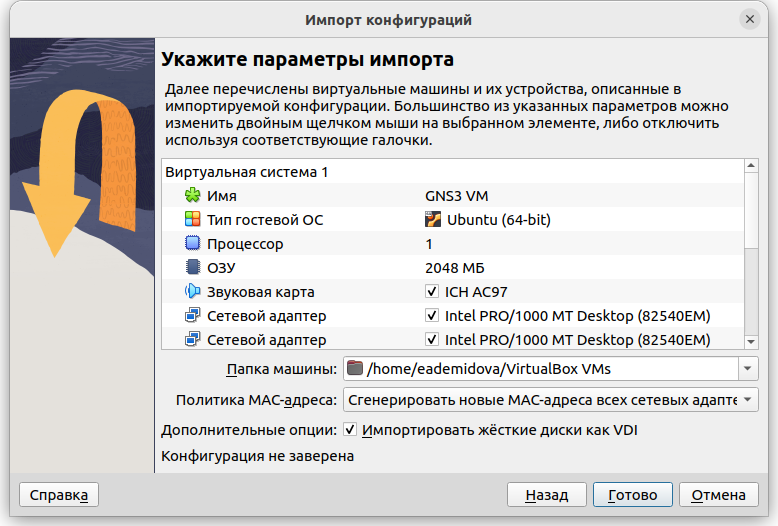{#fig:003 width=70%}

Уточним параметры настройки виртуальной машины GNS3 VM в VirtualBox.
Для этого в VirtualBox выберем импортированную виртуальную машину и перейдем в меню Машина-Настроить. Перейдем к опции «Система». Исправим неправильные настройки: скачаем недостающее ПО, поменяем количество выделяемой памяти(рис. @fig:004). Также настроим вложенную виртуализацию в VirtualBox. Перейдем к опции «Система» и вкладке «Процессор». Так как нет возможности в графическом интерфейсе отметить флажок «Включить Nested VT-x/AMD-V», для включения вложенной виртуализации воспользуемся командной строкой терминала и введем команду(рис. @fig:005):

```
vboxmanage modifyvm "GNS3 VM" --nested-hw-virt on
```

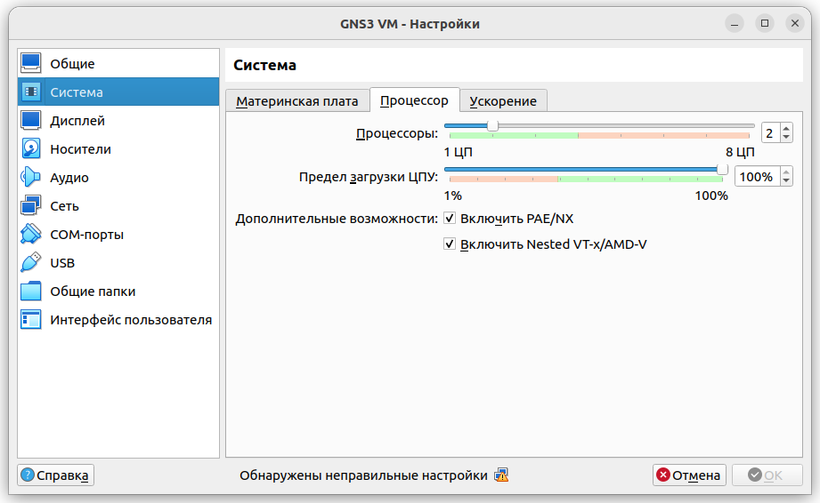{#fig:004 width=70%}

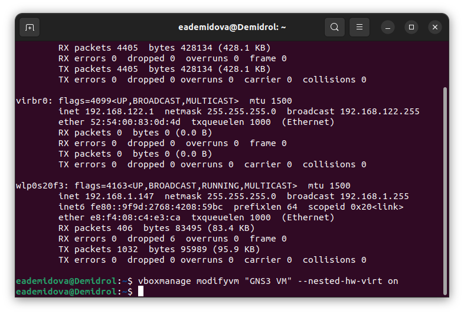{#fig:005 width=70%}

Также настроим сетевой адаптер. Для этого в VirtualBox выберем импортированную виртуальную машину и перейдем в меню Машина-Настроить. Перейдем к опции «Сеть» и во вкладке «Адаптер 1» тип подключения установим как «Виртуальный адаптер хоста». В этом режиме адаптер хоста используем специальное устройство vboxnet0(так как его оно не было создано автоматически, я его создала, воспользовавшись менеджером сетей хоста в VirtualBox для создания сети), создается подсеть и назначаются IP-адреса сетевым картам гостевых операционных систем.

Запустим экземпляр GNS3 в VirtualBox для проверки корректности работы.
Запустим GNS3 VM в VirtualBox. Затем в основной операционной системе запустим приложение gns3. При запуске приложения gns3 откроем setup wixard - мастер настройки, в котором выберем первый способ работы с gns3 — «Run appliance in a virtual machine» (т.е. запуск устройства на виртуальной машине), нажмем Next(рис. @fig:006).

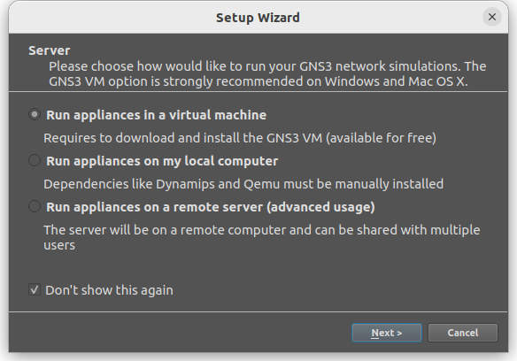{#fig:006 width=70%}

После успешного подсоединения появилось окно с итоговыми настройками, на котором следует нажать Finish (рис. @fig:007).

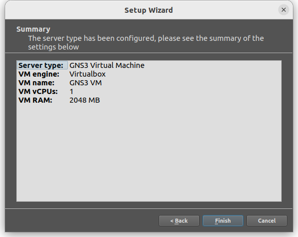{#fig:007 width=70%}

В результате мы успешно запустили экземпляр GNS3 в VirtualBox(рис. @fig:008).

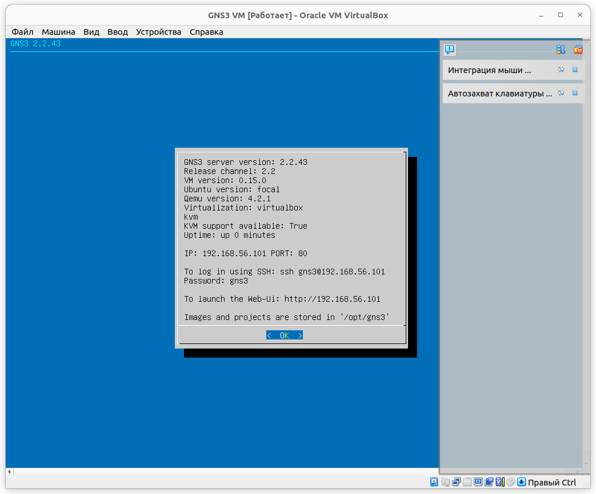{#fig:008 width=70%}

## Добавление образа маршрутизатора FRR

Требуется добавить образ маршрутизатора FRR. В рабочем пространстве GNS3 на левой боковой панели выберем просмотр маршрутизаторов (Browse Routers), затем нажмем на +New template. В открывшемся окне укажем рекомендуемое верхнее значение, а именно, устанавливаем образ с GNS3-сервера, нажмем Next (рис. @fig:009). 

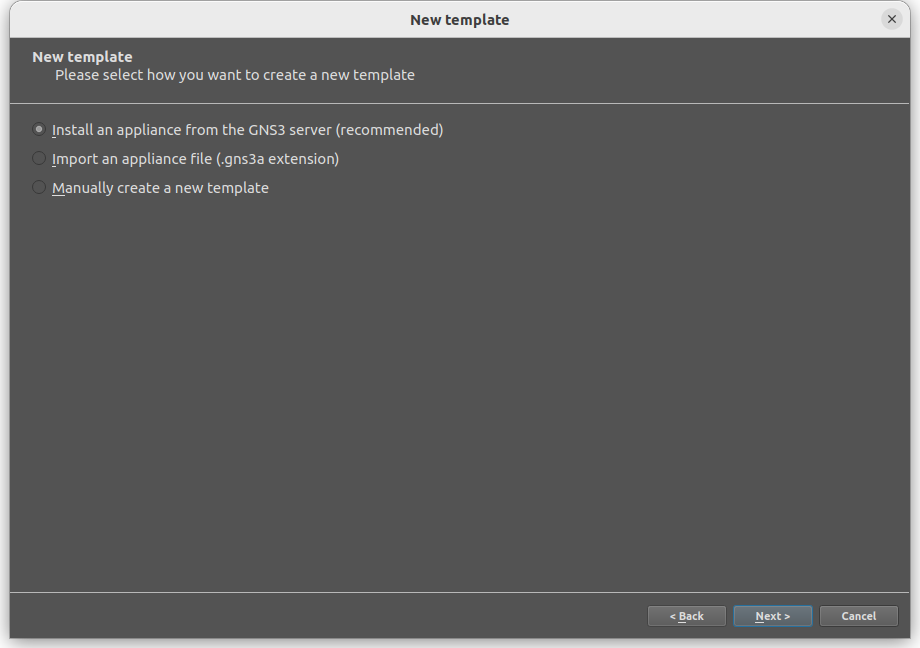{#fig:009 width=70%} 


В следующем окне выберем Routers и образ FRR (FRRouting), нажмем Install(рис. @fig:010). В следующем окне укажем, что устанавливать образ следует на виртуальную машину GNS3 VM, нажмем Next. Далее предлагается выбор эмулятора, оставим предложенное, нажмем Next. В следующем окне предлагается перечень файлов для скачивания и последующей установки. Выберем наиболее актуальную версию(в нашем случае это 8.2.2) и нажмем Download(рис. @fig:011)

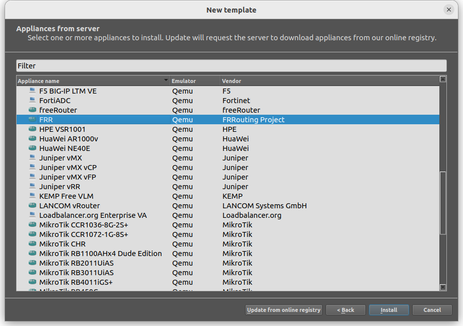{#fig:010 width=70%}

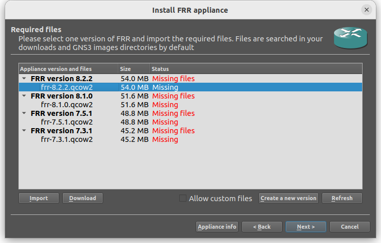{#fig:011 width=70%}

После окончания скачивания (процесс скачивания отобразился
в браузере основной ОС) импортируем образ, затем нажмем Next(@fig:012). 

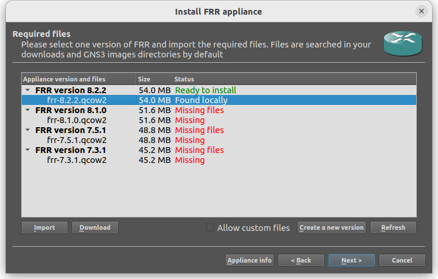{#fig:012 width=70%}

На заключительном окне указывается краткая информация об устройстве,
просмотрев её, нажмем Finish (@fig:013). 

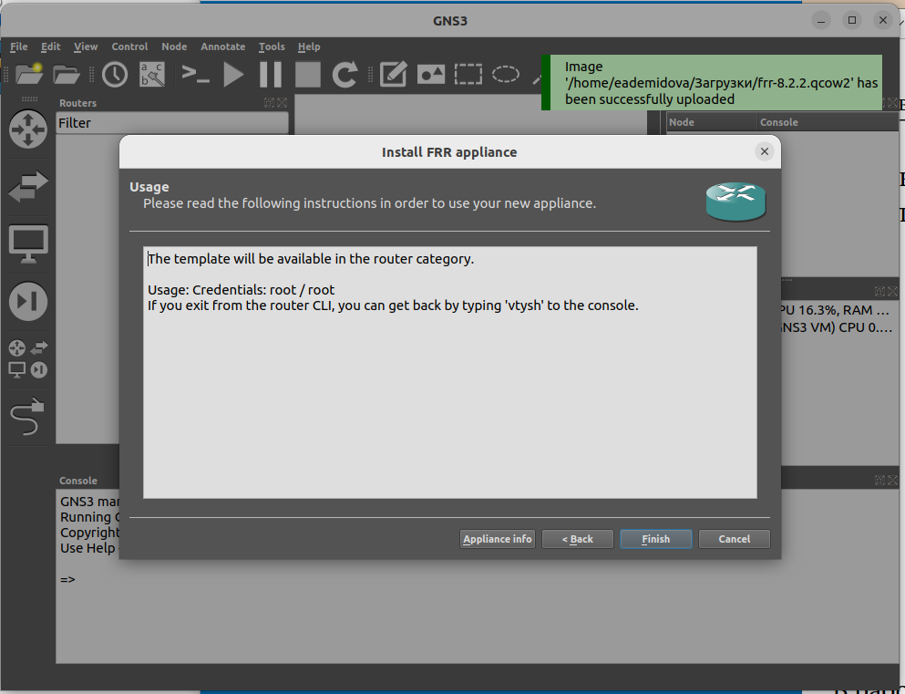{#fig:013 width=70%}

В рабочем пространстве на левой панели в списке маршрутизаторов появился образ устройства FRR.
Далее необходимо настроить образ маршрутизатора. Правой кнопкой мыши
щёлкнем на образе устройства, в меню выберем Configure template.
В открывшемся во вкладке «General settings» (@fig:014) в поле «On close» выберем Send the shutdown signal (ACPI). Во вкладке «HDD» (@fig:015) поставим галочку «Automatically create a config disk on HDD».

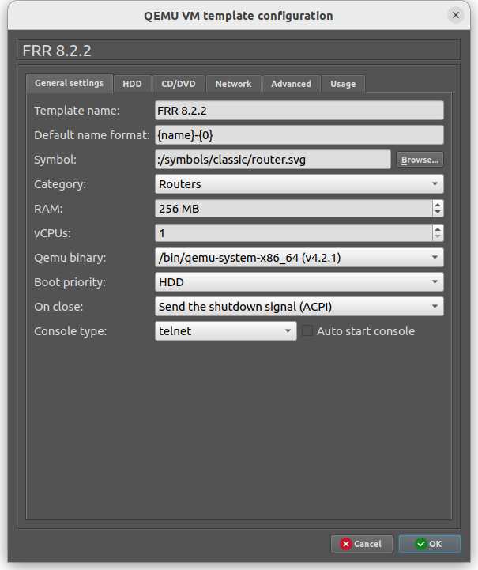{#fig:014 width=70%}

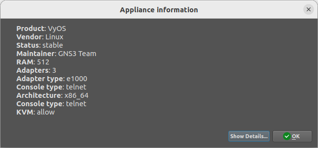{#fig:015 width=70%}

# Добавление образа маршрутизатора VyOS

В GNS3 требуется добавить образ платформы маршрутизации VyOS (https://vyos.net/). Для этого скачаем  файл vyos-edu.gns3a из репозитория: https://github.com/yamadharma/vyos-build/releases. Затем импортируем vyos-edu.gns3a в GNS3 через пункт меню File>Import appliance. 

В открывшемся окне укажем, что образ следует устанавливать с GNS3-сервера. В следующем окне выберем Routers и образ VyOS, нажмем Install . Далее укажем, что устанавливать образ следует на виртуальную машину GNS3 VM (@fig:016).

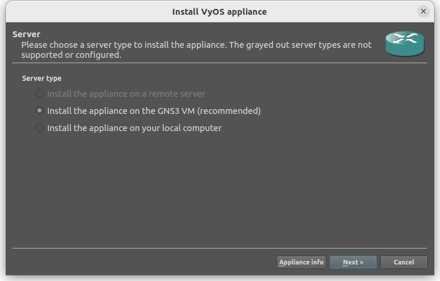{#fig:016 width=70%}

Затем скачаем недостающие файлы(@fig:017). Теперь можно установить образ (@fig:018, @fig:0019).

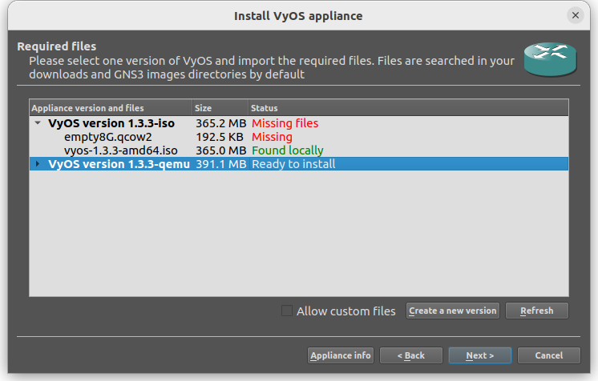{#fig:017 width=70%}

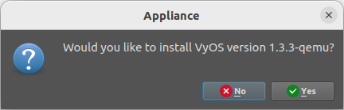{#fig:018 width=70%}

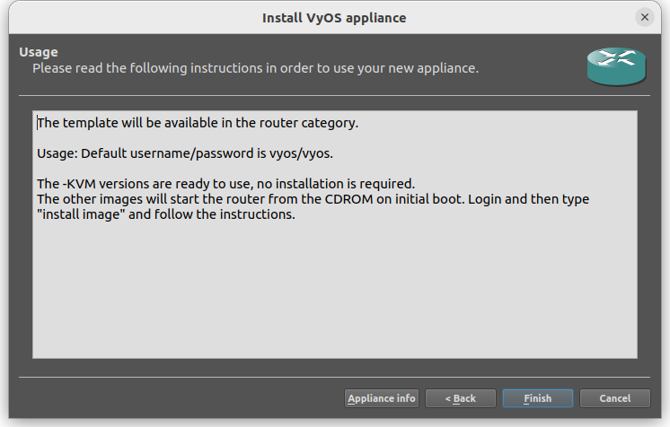{#fig:019 width=70%}

Далее необходимо настроить образ маршрутизатора. Правой кнопкой мыши
щёлкните на образе устройства, в меню выберете Configure template. В открывшемся окне необходимо во вкладке «General settings» в поле «On close» выбрать Send the shutdown signal (ACPI). Во вкладке «HDD» необходимо поставить галочку
«Automatically create a config disk on HDD»(@fig:0020).

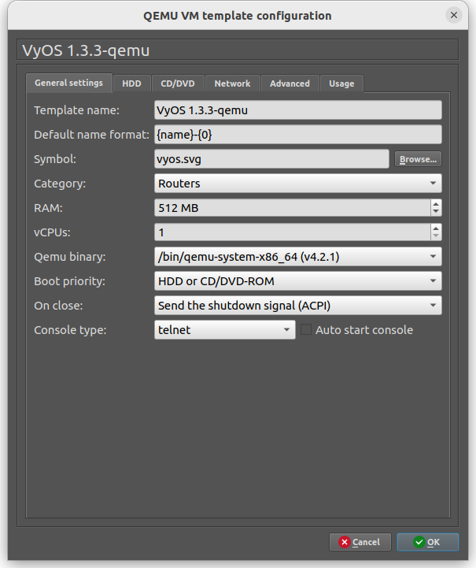{#fig:020 width=70%}

# Выводы

В результате выполнения лабораторной работы были установлены  GNS3-all-in-one, GNS3 VM и проверена корректность их работы. Также импортированы образы маршрутизаторов FRR и VyOS.


