---
## Front matter
title: "Лабораторная работа №5"
subtitle: "Простые сети в GNS3. Анализ трафика"
author: "Демидова Екатерина Алексеевна"

## Generic otions
lang: ru-RU
toc-title: "Содержание"

## Bibliography
# bibliography: bib/cite.bib
# csl: pandoc/csl/gost-r-7-0-5-2008-numeric.csl

## Pdf output format
toc: true # Table of contents
toc-depth: 2
lof: true # List of figures
lot: false # List of tables
fontsize: 12pt
linestretch: 1.5
papersize: a4
documentclass: scrreprt
## I18n polyglossia
polyglossia-lang:
  name: russian
  options:
	- spelling=modern
	- babelshorthands=true
polyglossia-otherlangs:
  name: english
## I18n babel
babel-lang: russian
babel-otherlangs: english
## Fonts
mainfont: PT Serif
romanfont: PT Serif
sansfont: PT Sans
monofont: PT Mono
mainfontoptions: Ligatures=TeX
romanfontoptions: Ligatures=TeX
sansfontoptions: Ligatures=TeX,Scale=MatchLowercase
monofontoptions: Scale=MatchLowercase,Scale=0.9
## Biblatex
biblatex: true
biblio-style: "gost-numeric"
biblatexoptions:
  - parentracker=true
  - backend=biber
  - hyperref=auto
  - language=auto
  - autolang=other*
  - citestyle=gost-numeric
## Pandoc-crossref LaTeX customization
figureTitle: "Рис."
tableTitle: "Таблица"
listingTitle: "Листинг"
lofTitle: "Список иллюстраций"
lotTitle: "Список таблиц"
lolTitle: "Листинги"
## Misc options
indent: true
header-includes:
  - \usepackage{indentfirst}
  - \usepackage{float} # keep figures where there are in the text
  - \floatplacement{figure}{H} # keep figures where there are in the text
---

# Цель работы

Построение простейших моделей сети на базе коммутатора и маршрутизаторов FRR и VyOS в GNS3, анализ трафика посредством Wireshark.

# Задание

1. Смоделировать простейшую сеть на базе коммутатора в GNS3 
2. Проанализировать трафик в GNS3 посредством Wireshark
3. Смоделировать простейшую сеть на базе маршрутизатора FRR в GNS3
4. Смоделировать простейшую сеть на базе маршрутизатора VyOS в GNS3

# Выполнение лабораторной работы

## Моделирование простейшей сети на базе коммутатора в GNS3

1. Построить в GNS3 топологию сети, состоящей из коммутатора Ethernet и двух оконечных устройств (персональных компьютеров).
2. Задать оконечным устройствам IP-адреса в сети 192.168.1.0/24. Проверить связь.

Запустим GNS3 VM и GNS3 и создадим новый проект.
В рабочей области GNS3 разместим коммутатор Ethernet и два VPCS. Щёлкнув
на устройстве правой кнопкой мыши в меню Configure изменим название устройства, включив в имя устройства имя своей учётной записи. Коммутатору присвоим название msk-eademidova-sw-01(рис. @fig:001). Затем соединим VPCS с коммутатором и отобразим обозначение интерфейсов соединения(рис. @fig:002).

{#fig:001 width=70%}

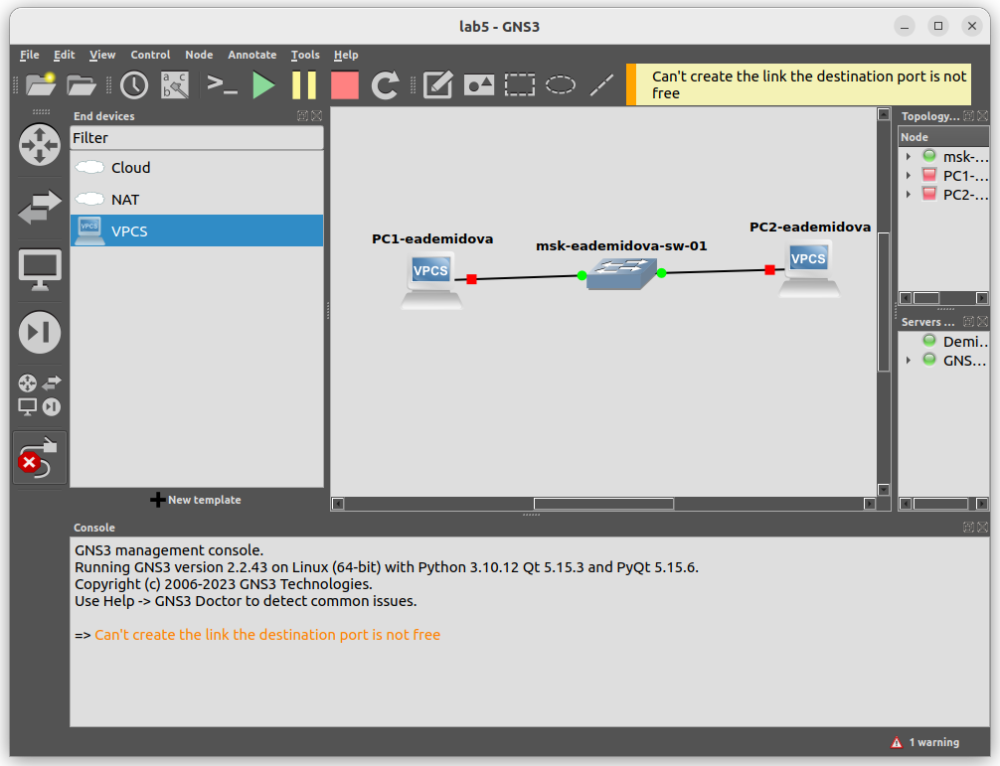{#fig:002 width=70%}

Зададим IP-адреса VPCS. Для этого с помощью меню, вызываемого правой кнопкой мыши, запуститм Start, PC-1, затем вызовим его терминал Console. Для просмотра синтаксиса возможных для ввода команд наберем /?(рис. @fig:003).

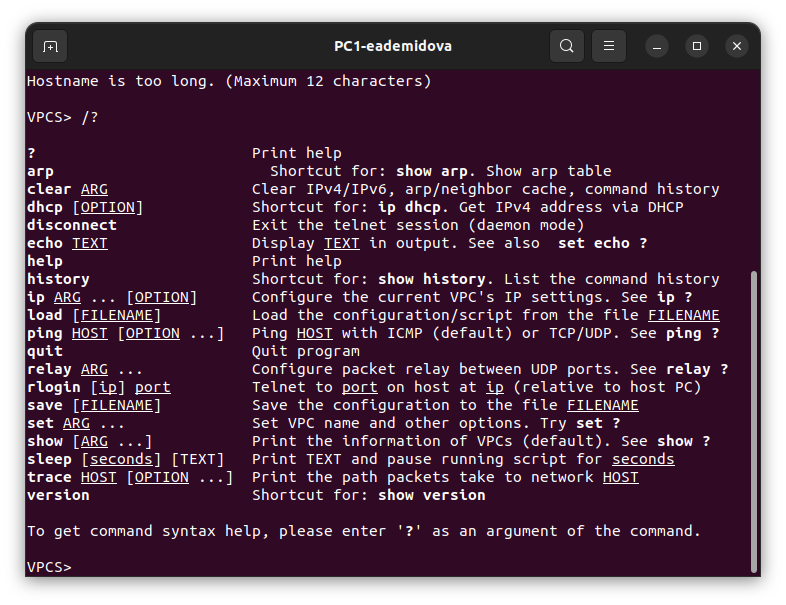{#fig:003 width=70%}


Для задания IP-адреса 192.168.1.11 в сети 192.168.1.0/24 введем:

```
ip 192.168.1.11/24 192.168.1.1
```

А для сохранения конфигураций введём команду save(рис. @fig:004).

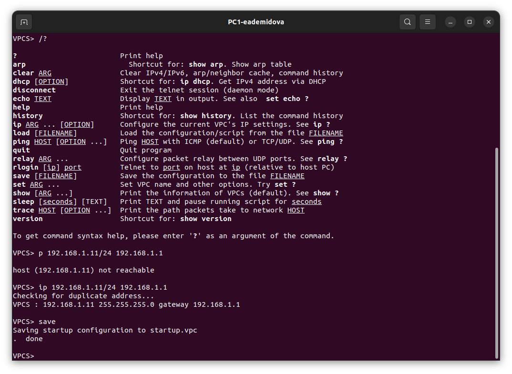{#fig:004 width=70%}

Те же действия продоелаем для второго VPCS(рис. @fig:005):

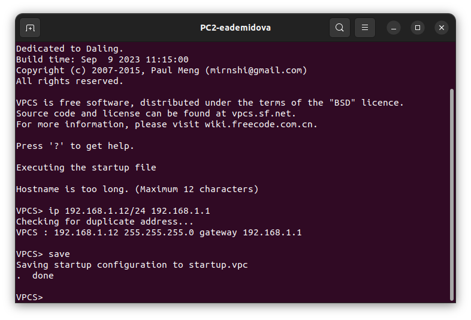{#fig:005 width=70%}

Проверим работоспособность соединения между PC-1 и PC-2 с помощью команды ping(рис. @fig:006).

{#fig:006 width=70%}

В конце остановим в проекте все узлы(меню GNS3 Control Stop all nodes).


## Анализ трафика в GNS3 посредством Wireshark

1. С помощью Wireshark захватить и проанализировать ARP-сообщения.
2. С помощью Wireshark захватить и проанализировать ICMP-сообщения.

Запустим на соединении между PC-1 и коммутатором анализатор трафика. Для этого щёлкним правой кнопкой мыши на соединении, выберем в меню Start capture(рис. @fig:007).

{#fig:007 width=70%}

Запустился Wireshark, а в проекте GNS3 на соединении появился значок (рис. @fig:008).

{#fig:008 width=70%}

В проекте GNS3 стартуем все узлы (меню GNS3 Control Start/Resume all nodes). В окне Wireshark отобразилась информация по протоколу ARP. 

Изучим запрос и ответ ARP в программе Wireshark(рис. @fig:009). В обоих случаях длина кадра равняется 98 байт. В начале сформировались запросы безвоздмездных пакетов ARP для PC-1(в этом случае источник -- Private_66:68:00, а пункт назначения - Broadcast) и для PC-2(в этом случае источник -- Private_66:68:01, а пункт назначения - Broadcast). Затем был сформирован запрос от PC-2 на передачу MAC-адоеса PC-1 и получен ответ - MAC-адрес.

{#fig:009 width=70%}

В терминале PC-2 посмотрим информацию по опциям команды ping, введя ping /?. Затем сделаем один эхо-запрос в ICMP-моде к узлу PC-1(рис. @fig:010). Изучим эхо-запрос и эхо-ответ ICMP в программе Wireshark(рис. @fig:011). В обоих случаях длина кадра равняется 98 байт. В случае эхо-запроса точка назначения – PC-1, а источник – PC-2, в случае же эхо-ответа – наоборот.

{#fig:010 width=70%} 

{#fig:011 width=70%} 

Сделаем один эхо-запрос в UDP-моде к узлу PC-1(рис. @fig:012). В окне Wireshark
проанализируем полученную информацию(рис. @fig:013).  В обоих случаях длина кадра равняется 98 байт. В случае эхо-запроса точка назначения – PC-1, а источник – PC-2, в случае же эхо-ответа – наоборот.

{#fig:012 width=70%}

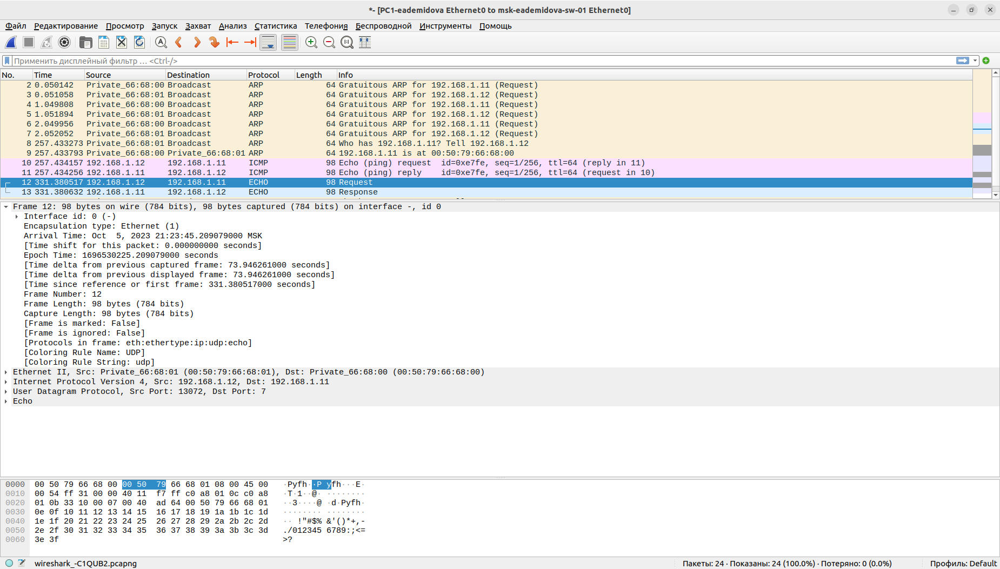{#fig:013 width=70%}

Сделаем один эхо-запрос в TCP-моде к узлу PC-1(@fig:012). В окне Wireshark проанализируем полученную информацию(@fig:013). Порт источника задан случайно равен 35487, порт назначения равен 7. В случае ответа порты заданы наоборот. Также можно увидеть handshake протокола TCP. В первом пакете установлен бит SYN(Syn: set). Во втором пакете установлены биты SYN и ACK(Syn: set, Acknowldgment: set). А в следующем пакете установлен бит ACK(Acknowldgment: set). Также есть пакеты с битом FIN, завершающим handshake.

{#fig:014 width=70%}

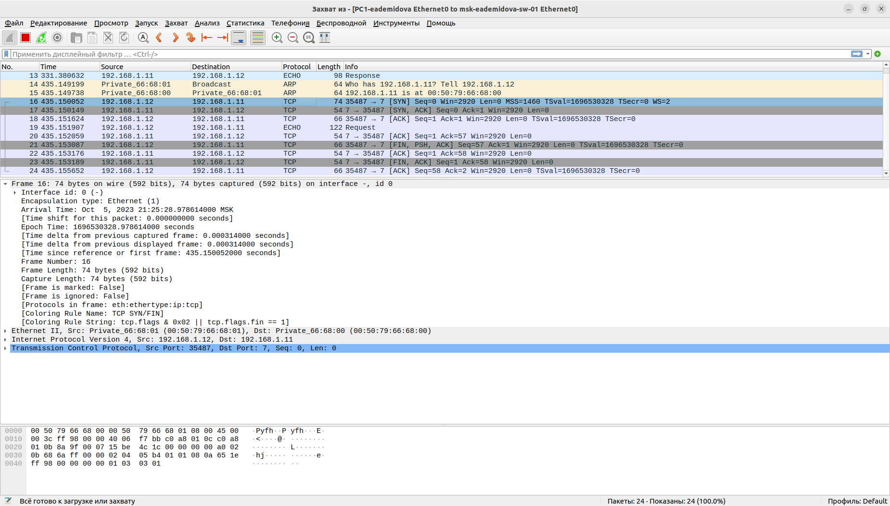{#fig:015 width=70%}

Остановим захват пакетов в Wireshark.

## Моделирование простейшей сети на базе маршрутизатора FRR в GNS3


1. Построить в GNS3 топологию сети, состоящей из маршрутизатора FRR, ком-
мутатора Ethernet и оконечного устройства.
2. Задать оконечному устройству IP-адрес в сети 192.168.1.0/24.
3. Присвоить интерфейсу маршрутизатора адрес 192.168.1.1/24
4. Проверить связь.

Запустим GNS3 VM и GNS3. Создадим новый проект.
В рабочей области GNS3 разместим VPCS, коммутатор Ethernet и маршрутизатор FRR. Изменим отображаемые названия устройств. Включим захват трафика на соединении между коммутатором и маршрутизатором (@fig:014). Затем запустим все устройства проекта(@fig:015). Откроем консоль всех устройств проекта (@fig:016).

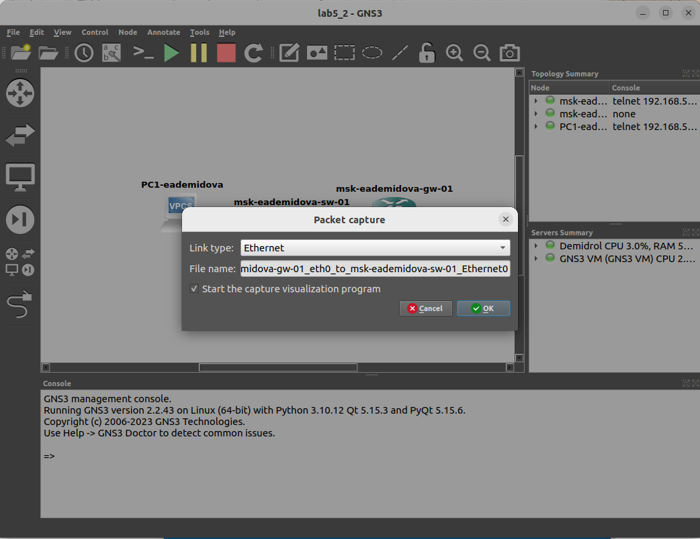{#fig:016 width=70%}

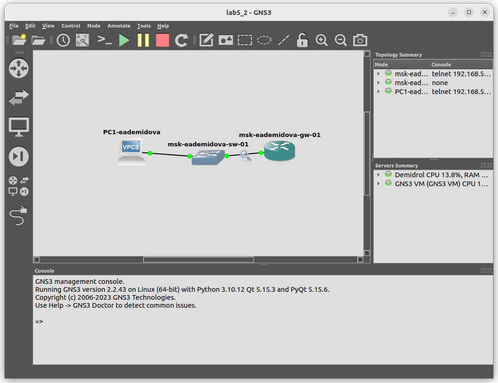{#fig:017 width=70%}

{#fig:018 width=70%}

Настроим IP-адресацию для интерфейса узла PC1(@fig:019):

{#fig:019 width=70%}

Настроим IP-адресацию для интерфейса локальной сети маршрутизатора(@fig:020):

{#fig:020 width=70%}

Проверим конфигурацию маршрутизатора и настройки IP-адресации(@fig:021):

{#fig:021 width=70%}

Проверим подключение. Узел PC1 успешно отправлять эхо-запросы ICMP на адрес маршрутизатора 192.168.1.1(@fig:022).

{#fig:022 width=70%}

В окне Wireshark проанализируем полученную информацию(@fig:023). Было отпрвлено 5 пакетов формата ICMP. В эхо-запросе источником является IP-адрес PC-1, а пунтком назначения -- IP-адрес шлюза марщрутизатора. В эхо-ответе -- наоборот. Также были сформированы ARP пакеты запрашивающий MAC-адрес шлюза маршрутизатора перед пингованием его и сообщающий этот MAC-адреc PC-1, а затем запрашивающие MAC-адрес PC-1 и сообщающие его шлюзу.

{#fig:023 width=70%}

В конце остановим захват пакетов в Wireshark и остановим все устройства в проекте.

## Моделирование простейшей сети на базе маршрутизатора VyOS в GNS3

1. Построить в GNS3 топологию сети, состоящей из маршрутизатора VyOS, ком-
мутатора Ethernet и оконечного устройства.
2. Задать оконечному устройству IP-адрес в сети 192.168.1.0/24.
3. Присвоить интерфейсу маршрутизатора адрес 192.168.1.1/24
4. Проверить связь.

Запустим GNS3 VM и GNS3. Создадим новый проект.

В рабочей области GNS3 разместим VPCS, коммутатор Ethernet и маршрутизатор VyOS.

Изменим отображаемые названия устройств. Включим захват трафика на соединении между коммутатором и маршрутизатором. Запустим все устройства проекта. Откройте консоль всех устройств проекта(@fig:024).

{#fig:024 width=70%}


Настроим IP-адресацию для интерфейса узла PC1(@fig:025).

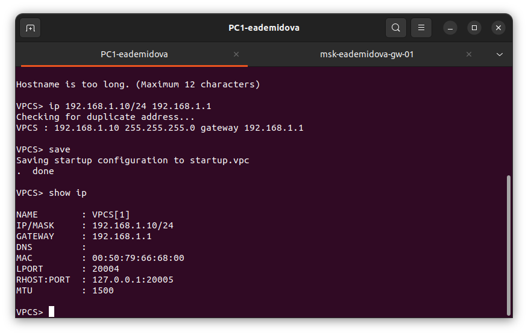{#fig:025 width=70%}

Настроим маршрутизатор VyOS. После загрузки введем логин vyos и пароль vyos: В рабочем режиме в командной строке отображается символ $. Перейдем в режим конфигурирования с помощью команды `configure`. Изменим имя устройства с помощью команды `set system host-name msk-eademidova-gw-01`.
Изменения в имени устройства вступят в силу после применения и сохранения конфигурации и перезапуска устройства.

Затем зададим IP-адрес на интерфейсе eth0. Но так как на моем устройстве уже был установлен dhcp адрес, то сначала я удалила его, а затем установила адрес IPv4.   Также просмотрим внесённые в конфигурацию изменения, применим эти изменения и сохраним. В конце выйдем из режима конфигурирования(@fig:026).

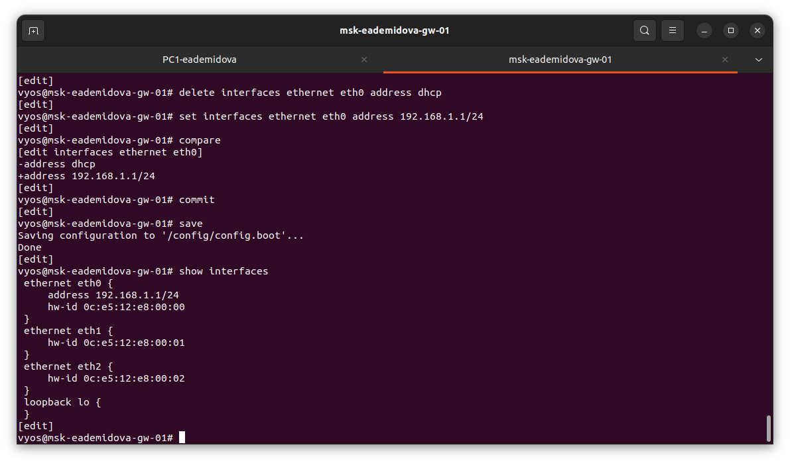{#fig:026 width=70%}

Проверим подключение. Узел PC1 дуспешно отправлять эхо-запросы на адрес маршрутизатора 192.168.1.1(@fig:027).

{#fig:027 width=70%}

В окне Wireshark проанализируйте полученную информацию(@fig:028). Было отпрвлено 5 пакетов формата ICMP. В эхо-запросе источником является IP-адрес PC-1, а пунтком назначения -- IP-адрес шлюза марщрутизатора. В эхо-ответе -- наоборот. Также были сформированы ARP пакеты запрашивающий MAC-адрес шлюза маршрутизатора перед пингованием его и сообщающий этот MAC-адреc PC-1, а затем запрашивающие MAC-адрес PC-1 и сообщающие его шлюзу.

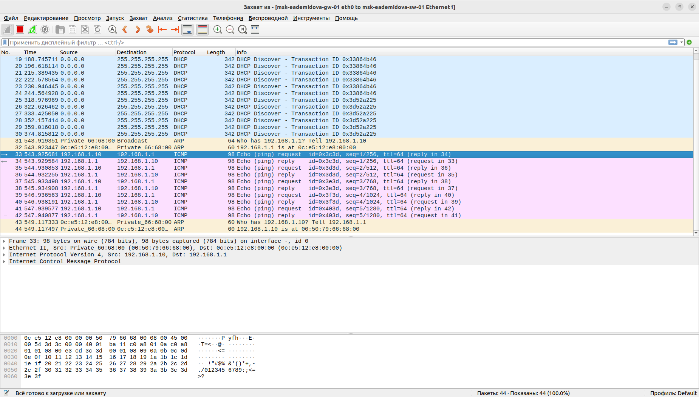{#fig:028 width=70%}


# Выводы

В результате выполнения лабораторной работы были построены простейшие модели сети на базе коммутатора и маршрутизаторов FRR и VyOS в GNS3, а также проанализирован трафик посредством Wireshark.


